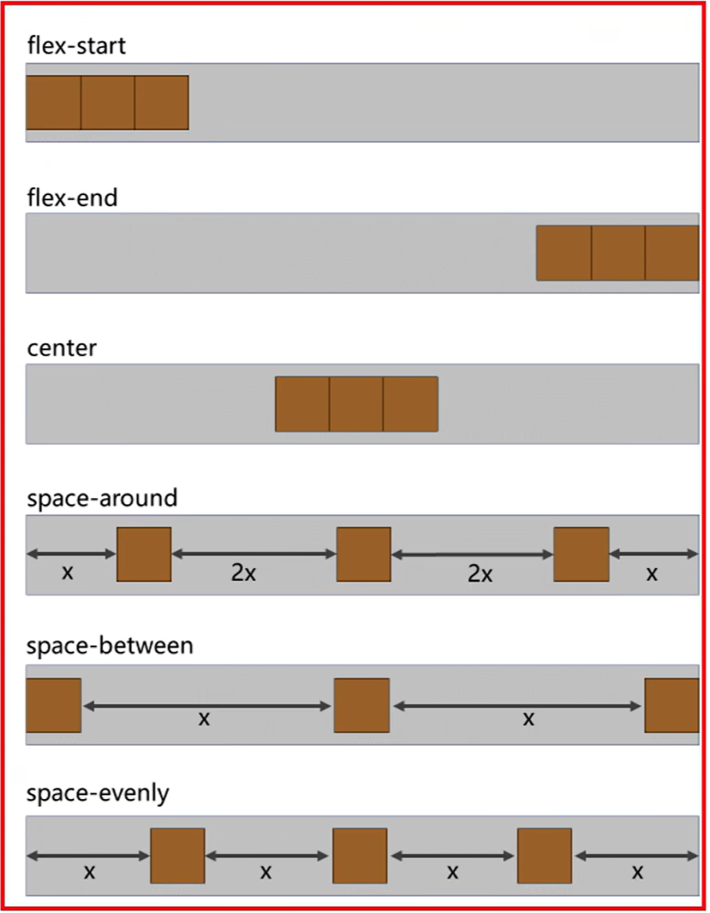
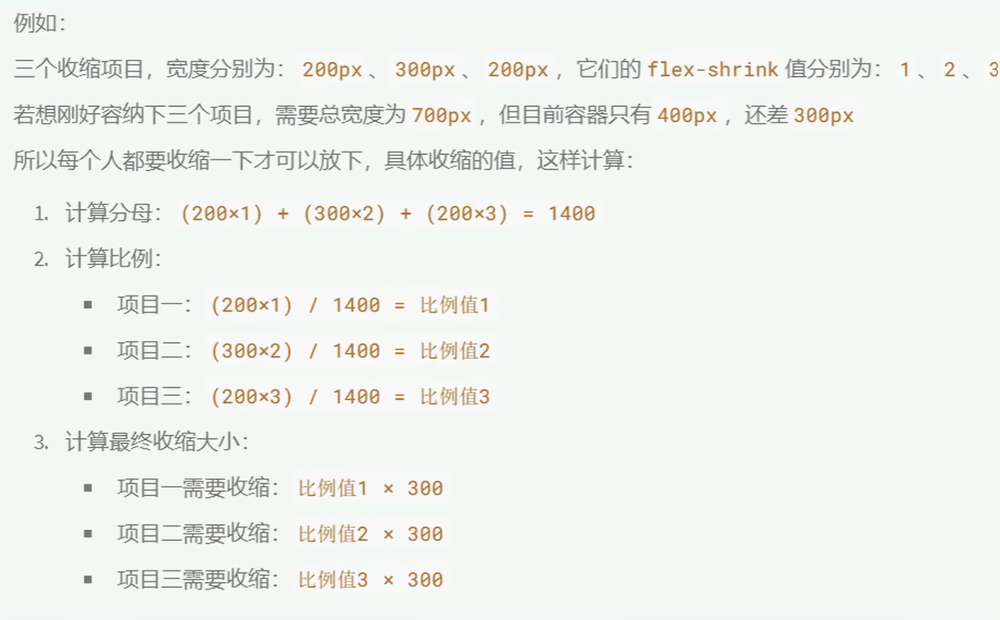
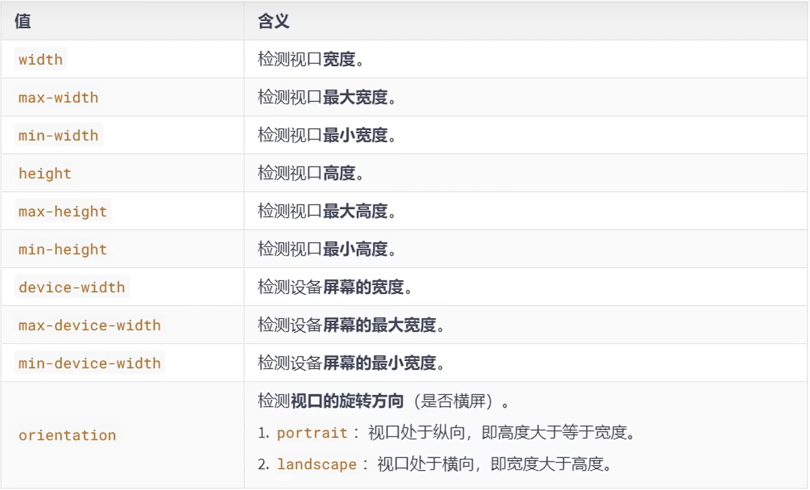

> # CSS放入HTML
> 放入head标签中：
```    
<style>
	p {
		color: blue;
		font-size: 16px;
	}
</style>
```
---
# 0 CSS三种导入方式
1. 内联样式：直接放在HTML标签中用style定义
	> 例子：  
	```
	<body>
		<h1 style="color: green;">This is a Tier one title</h1>
	</body>
	```
2. 内部样式表：如上在HTML的head标签中
	> 例子：  
	```
	<style>
		/* 选择器 {声明块} */
		h2 {
			color: red;
		}
	</style>
	<body>
		<h2>This is a Tier two title using 内部样式</h2>
	</body>
	```
3. 外部样式表：单独放在一个CSS文件中，在head中引用（可复用）
	- 在HTML所在目录下新建文件夹中存放CSS文件，并在HTML中用<link rel="stylesheet" type="text/css" href="./css/style.css">进行导入
	- type="text/css"是默认的可以省略，如果不是css样式表请声明
---
-  **！** 优先级1>2>3
- 如果外部样式放在内部样式的后面，则外部样式将覆盖内部样式！
	```
	<style type="text/css">
      h3{color:green;}
    </style>
    <link rel="stylesheet" type="text/css" href="style.css"/>
	```
---

# 1 CSS选择器
- 通用选择器：用\*表示，即\* {...}，对所有元素起变化
- 元素选择器：（就像上面那样，style中规定的是全局的，所有h2都要变）
- 类选择器：用.表示（可利用类、id等条件控制部分元素的变化）  
	```
	.highlight {
		background-color: yellow;
	}
	<h2 class="highlight">only h2 in highlight class will be changed!</h2>
	```
	> **注意！**
	> · 即使类型不同，只要属于一个class，也起作用
	> · ☆如果想让一个元素属于两个或多个class，请将class用空格隔开：`<p class="classA classB">`
	> · 后面的类会覆盖之前的类，注意不是行内样式中的先后，而是内部样式中的先后，即`<p class="classB classA>`并不改变顺序
- id选择器：用\#表示，精准到一个，不能重复且一个元素只能有1个id  
	```
	#id01 {
		background-color: yellow;
	}
	```

- 交集选择器：如`h1.classA`表示作用于classA的h1标题
	- 注意元素选择器放类~之前
	- 利用多个类选择器可逐层添加属性：
	```
	<h1 class="center">标题居中</h1>
	<p class="center color">段落居中，颜色为红色。</p>
	```
- 并集选择器：`.classA,.classB,.classC`，一般逗号后换行
- 子元素选择器：只对儿子辈生效 .xx> x，如div>p
- 后代选择器：所有后代包含儿子辈 .xx x，如div p
- 相邻兄弟选择器: 对该元素之后的第一个元素生效 xx + x, 如div+p
	```
	div+p
	{
		background-color:yellow;
	}	
	...
	<div>
	<h2>DIV 内部标题</h2>
	<p>DIV 内部段落。</p>
	</div>
	<p>DIV 之后的第一个 P 元素。</p>
	```
- 后续兄弟选择器：该元素之后的所有兄弟元素 xx ~ x, 如div~p
	
- 属性选择器：一般用来选择除了class和id属性以外的其它属性，如title等，用[]把属性名框起来
	```
	<style>
		[title] {...}			// 用法01，基本写法
		[title=".."] {...}		// 用法02，选择某指定值的属性
		[title^=".."] {...}		// 用法03，值开头为。。
		[title$=".."] {...}		// 用法04，值结尾为。。
		[title*=".."] {...}		// 用法05，值包含了。。
	</style>
	```
	> #### CSS 属性选择器 ~=, |=, ^=, $=, *= 的区别
	> ~=, |= 要求值为完整单词
	> 1.[attribute~=value] 属性中包含独立的单词为 value
	>   [attribute*=value] 属性中做字符串拆分，只要能拆出来 value 这个词就行
	> 2.[attribute|=value] 属性中必须是完整且唯一的单词，或者以 - 分隔开
	>   [attribute^=value] 属性的前几个字母是 value 就可以
	> 3.[attribute$=value] 属性的后几个字母是 value 就可以

- 伪类选择器：区分一个元素的不同**状态**，如访问过的超链接变灰色
	- 动态伪类
		```
		// 1.选中没有访问过的a元素
		a:link {
			color: orange;
		}
		// 2.选中访问过的a元素
		a:visited {...
		}
		// 3.选中鼠标悬浮的a元素
		a:hover {...
		}
		// 4.选中处于激活状态（点击不放）的a元素
		a:active {...
		}
		// 选中处于焦点的表单元素
		input:focus,
		select:focus {
			color: orange;
			background-color: yellow;
		}
		```
		> **!注意**
		> - 1-4的顺序不要改变否则导致有些效果无法显示（根据“后来居上”原理分析, a元素可能同时有link&hover&active状态）
		> - hover和active伪类在很多种元素上都适用
		
	- 结构伪类（较繁琐易错）
		```
		// 1 选择div的第一个p元素儿子，如果第一个元素不是p类型则结果为空
		div>p:first-child {...}
		// 2 选择div的最后一个p元素儿子
		div>p:last-child {...}
		// 3 选择div的第n个p元素儿子
		div>p:nth-child(2) {...}
		div>p:nth-child(2n) {...}	// 选取偶数序号的
		div>p:nth-child(-n+5) {...}	// 选取前5个
		// 4 第一个该类型的儿子/最后一个.../第n个...
		div>p:first-of-type {...}	// 儿子中为该类型的第一个元素
		div>p:last-of-type {...}
		div>p:nth-of-type {...}
		// 
		div>p:nth-last-child(2) {...} // 倒数的第n个
		div>p:nth-last-of-type {...}
		div>p:only-of-type {...}
		div>p:only-child {...}
		:root {...}
		:invalid :enabled/disabled // input的伪类
		div:empty {...}
		```
		> **!注意** 
		> - 若1中div的第一个儿元素不是p类型，则结果为空，没有任何元素被选中，依此类推（可以使用4则可以选中第一个p元素）
		> - 3中注意括号内的形式必须是an+b，即不能写成5-n；同理(2)即(0n+2)；0或留空无法选中任何元素
		> #### first-child和first-of-type的区别
		> 
		
	- 否定伪类: 排除
		```
		div>p:not(.fail){...}	// 排除类名为fail的元素
		div>p:not([title^="..."]){...}	// 排除title属性值开头为...的元素
		div>p:not(:first-child){...}	// 排除第一个儿p元素
		```
	- UI伪类: 复选框、单选按钮、表单（是否禁用）
		```
		input:checked {...}
		input:disabled {...}
		```
		> 复选框和单选按钮不能操作颜色和背景色属性
	- 目标伪类：`div:target`与超链接搭配：`<a href="#first">跳到第一个</a>`，**即对链接目标的元素进行样式设置，当点击超链接后进行显示**
	- 语言伪类：`div:lang(en)` `div:lang(zh-CN)`
- 伪元素选择器: 例如一段话中选首字母
	```
	div::first-letter {..}
	div::first-line {..}
	div::selection {..}	// 被鼠标选中的文字（CSS3）
	input::placeholder {..}	// 被鼠标选中的表单框中的文字（CSS3）
	p::before {content=“”}		// !注意用等号有可能不生效，需要用`content:""`
	p::after {content=“”}		// 
	```

> ## 权重与选择器优先级
> 行内样式 > ID选择器 > 类选择器 > 元素选择器 > 通配选择器
> **权重：(a：ID选择器个数, b：类/伪类/属性选择器的个数, c：元素/伪元素选择器的个数)**
> 比较：a b c依次比较，大者胜出；都一样则依旧采用“后来居上”原则(标准术语为“层叠”)
> !important加在属性值后则优先级最高（<u>但权重无变化，只有该属性优先级最高</u>）：`.class {color: orange !important; font-size: 40px}`


# 2 CSS常用属性

## 颜色 
- 方式一：名称
- 方式二：rgb(255红,255绿,255蓝)或rgb(100%,100%,100%)或rgba(255,255,255,0.5)控制透明度
	- vscode点击颜色方框可以调整rgb
- 方式三：十六进制HEX：#?????? 前两位控制红色，依此类推 或 HEXA：#???????? 最后两位控制透明度
- 方式四：HSL：hsl(色相，饱和度，亮度)，如(0deg,100%,%50),deg可以省略 
	- 亮度100%就变白色了，一般设置为一个中间值

## 字体
- 大小: font-size 
	- chrome最小值12px
	- 若为0px则不显示
	- font-等属性有继承性
- 字体: font-family
	- 字体族：罗列几种字体，依次看是否有该种字体，没有往后查找使用，如：`font-family: "黑体", "宋体", "楷体"`
	- 考虑兼容性，字体名最好写英文如Microsoft YaHei(Windows默认字体微软雅黑)
	- 字体族最后可以加上`sans-serif`(非衬线，不加引号)或`serif`(衬线，不加引号)，当前面所有字体都没有的时候，浏览器自动在本地查找非衬线字体使用
- 字体风格: font-style
	- normal/italic/oblique
	- italic和oblique的区别：italic(使用设计的斜体，若无则倾斜正体) oblique(强制倾斜正体)
- 粗细: font-weight
	- normal/lighter/bold/bolder(是否奏效看字体有无设计）
	- 也可以使用数字，但也只对应上面几档，100-300对应细体，400-500对应正常，600以上对应bold
- 字体复合属性: font
	- 规则：必须有字体大小（必须倒数第二位）和字体族（必须最后一位），其余放前面

## 文本
- 颜色: color
- 间距
	- letter-spacing
	- word-spacing: 对中文无效，若要有效，把中文间加上空格
	- 可以为负值，文字会重叠
- 修饰: text-decoration
	- overline 上划线
	- underline 下划线
	- line-through 删除线
	- none （主要用于a链接）
	- 可以修改划线的样式，如`underline dotted`虚线，`underline wavy red`红色波浪线，顺序可以随意
- 缩进: text-indent
- 对齐: text-align: left(默认)/center/right
- 行高
	- 值为px
	- 值为normal，由浏览器自动设置
	- 值为数值，表示为font-size的倍数，行高为该倍数乘以fs，一般范围为1.5~2.0
	- 值为百分比，类似数值，如150%
	- 注意
		- 行高最小值为0，可以继承
		- 大文字和小文字按字体基线对齐
		- line-height和height
	- (较繁)**vertical-align**: top/bottom/baseline(默认)/middle

## 列表 `<ul>/<ol>/<li>`
- 列表符号: list-style-type: none/square/lower-roman/decimal/...
- 列表符号位置: list-style-position: inside/outside 跟文字在一起还是在外面
- 自定义符号: list-style-image: url("../images/img.gif")
- 复合属性: list-style 复合以上属性，不区分顺序

## 表格及边框 `<table>`
- border-width
- border-color
- border-style: solid/dashed/none/double/...
- border 复合方式
> 注意
> border属性不仅表格可以用，像h1、span等也可以使用
- table-layout 控制表格列宽：auto/fixed
- border-spacing 控制单元格间距
- border-collapse 合并相邻单元格边框 separate/collapse
- empty-cells 隐藏没有内容的单元格 hide
- caption-side 表格标题的位置

## 背景
- background-image: url(../images/img.gif)
- background-repeat: repeat-x/repeat-y/no-repeat
- background-position: left top (默认) 或 50px 30px
- background 复合属性，不区分顺序和数量
- background-size: cover 铺满父元素

## 鼠标
- cursor: pointer/move/wait/crosshair/help/...
	- 用图片作为鼠标：`cursor: url("../images/arrow.png"), pointer`


# 3 盒子模型

## 前置知识 
- 长度单位
	- px
	- cm/mm
	- em：对font-size乘以一个倍数em（若自己没有设置fs则找其父元素的fs）
	- rem：相对于根元素<html>的倍数
	- 百分比%：相对于父元素的百分比
- 块元素/行内元素/行内块元素
	```
	| 类别     | 是否独占行 |  宽高是否取决于内容                  | 是否可以设置宽高  |    包括哪些元素    |
	|  ---     | ---       |      ---                           |         ---      |    ---             |
	| 块元素    | 独占一行  | 默认宽-撑满父元素，默认高-取决于内容   | 可以用CSS设置宽高 | <html> <h1> <p> <ul> <table> <form> <option>.. |
	| 行内元素  | 不独占一行 | 宽高均由内容撑开                     | **无法用CSS设置宽高** | <br> <em>等文本标签 <a> <label>.. |
	| 行内块元素 | 不独占一行 | 宽高均由内容撑开（所以应该算作行内元素）| **可以通过CSS设置宽高** |  <td> <th> <iframe> <input> <select> <button>.. |
	```
	> **整理**
	> 
	- 修改显示模式：设置属性**display：block/inline/inline-block**
	
## 组成

### 内容区 
	```
	width:
	min-width:	// 视口宽小于该值后出现滚动条左右滚动显示
	max-width:	// 视口宽大于该值后元素宽度不会随视口宽继续变大而变大
	height:
	min-height:
	max-height:	// 如果文字太多，显示上会溢出内容区
	```
	- width/height和min-/max-一般不一起使用因为没有必要
	- 默认宽度
		- 若没有指定元素宽高，则填满父元素，如div填满body
		- 且此时margin影响盒子宽高（总宽度=父content-margin）;（内容区宽高=父content-margin-border-padding）
### 内边距padding
	```
	padding-left/right/top/bottom
	padding: 20px;					//
	padding: 10px 20px;				// 上下 左右
	padding: 10px 20px 30px;		// 上 左右 下
	padding: 10px 20px 30px 40px;	// 上 右 下 左
	```
	- 注意行内元素如span，设置上下内边距会占据上下其它元素的位置造成重叠！
### 边框border
	```
	border-width:
	border-color:
	border-style:
	border-bottom-color: red;
	border-left: 20px solid purple;
	...
	```
### 外边距margin
	```
	//类似padding
	```
	- margin左右（必须是块元素）设置为auto，则“距离能有多远就多远” `margin: 0 auto //左右居中`
	- margin可以是负值
	- 行内元素设置上下margin没有效果
	
	> ##### margin塌陷
	> 第一个子元素的margin-top会作用于父元素，最后一个子元素的margin-bottom会作用于父元素
	> 解决方案：1.给父元素设置宽度不为0的padding或border：`border: 1px solid transparent`(不推荐)；2.**父元素设置属性overflow**：`overflow: hidden`
	> ##### margin合并	
	> 兄弟元素的margin-bottom与另一兄弟元素的margin-top会取较大值而非相加 (貌似开启flex后是相加)
	> 只给其中一个兄弟元素赋值margin即可规避该问题

## 其它

### 内容溢出
- **overflow属性**：visible（默认值）、hidden（隐藏不显示，常用）、scroll（无论是否溢出显示滚动条）、auto（溢出时显示滚动条）
- 设置overflow为hidden或auto解决溢出问题

### 元素隐藏
- **visibility属性**：show、hidden
- 也可用：`display: none`。<u>区别：前者元素仍然占位，后者不但看不见，也没有大小不占位了</u>

### 样式继承
- 能继承的属性：字体、文本、color等<u>不影响布局的（即和盒子模型没有关系）</u>
- 不能继承的：边框、背景、padding、margin、宽高、overflow等

### 文字和图片垂直居中
- 行内元素和行内块元素，可以被父元素当作文本处理
- 水平居中：
	- 子元素为块元素，父元素加上: `margin:0 auto`
	- 否，则父元素加上: `text-align:center`
- 垂直居中：
	- 子元素为块元素，子元素加上: `margin-top:父元素(content-子元素盒子总高)/2`
	- 否，则让父元素的height等于line-height，每个子元素加上: `vertical-align:middle`，并最好设置父元素`font-size:0`做到绝对垂直居中
	```
	.outer {
		width:400px;
		height:400px;
		text-align:center;
		line-height:400px;
		font-size:0px;
	}
	img {
		vertical-align:middle;
	}
	span {
		font-size:40px;
		vertical-align:middle;
	```
	
### 空白
- 由于换行引起行内元素或行内快元素间存在“空白”
	- 将其父元素设置font-size=0px，再设置自身的fs可解决问题
- 图片和下边界之间有空隙，是因为字体设计基线的原因 
	- 1.设置vertical-align为bottom（原本是baseline） 
	- 2.或设置fs=0px（适用于后面不加文字时）

	> **布局技巧**
	> 


# 4 浮动和定位

## 浮动后的影响及解决
- 浮动后的特点
	- 脱离文档流
	- 无论哪种元素浮动后默认宽高都是被内容撑开并不独占一行，且可以设置宽高
	- 不会产生margin合并/塌陷
	- 没有行内块的空白问题
- 浮动后的影响
	- 对兄弟元素：后面的兄弟元素会占据浮动元素前的位置
	- 对父元素：父元素高度塌陷，但宽度依然制约着子元素
- 解决方案
	- 父元素塌陷问题：方案1、设置height；方案二、设置`float:left`；方案三、设置`overflow:hidden`
	- 但以上都不能解决对后面兄弟元素的影响
	- `clear: both` 前提：自己不能浮动且不能是行内元素。效果：可以让自己但父元素依旧塌陷
	- 修正方案：最后一个元素（新加一个）为空白块元素并设置`clear: both`即可解决以上问题
	- 最佳方案：(其实最好的方式是不要把浮动和不浮动的元素放在一起)
		```
		.parent::after {
			content:'';
			display:block;
			clear:both;
		}
		```

## 定位
- 相对定位
	```
	position: relative;
	left: -50px;
	```
	> **注意：若元素开启任意定位，则层级高于普通元素，即可能覆盖其它普通元素**
	- 相对定位主要作用是微调元素位置而不脱离文档流
- 绝对定位
	```
	position: absolute;
	top: 0px; // ②
	left: 0px;
	
	.outer:hover .box2{		// 伪类加后代选择器，实现当鼠标置于外层框上时，box2绝对定位到left220px处
		left: 220px;
	}
	```
	
> 注意：
> 1. **与相对定位不同，绝对定位会脱离文档流，即类似浮动“飘起来”**（注意与浮动不同，文字一并移动）
> 2. 绝对定位的参考点：若元素没有脱离文档流，则参考父元素；若脱离文档流，则参考第一个开启定位的祖先元素，都没有则参考根html
> 3. left和right不能同时设置，top和bottom不能同时设置
> 4. 绝对定位不能与浮动同时使用，若是则以绝对定位为先
> 5. 绝对定位常和相对定位一起使用，以实现hover时显示新内容覆盖在原有元素的功能

- 固定定位 `position: fixed`
	- 参考视口（对于PC浏览器，视口）
	- 脱离文档流
- 粘性定位 `position: sticky`
	- 元素在页面滚动到达某一位置后固定下来
	- 常用top属性调整位置
	- 参考点为离它最近的一个有滚动机制的祖先元素
	- 不脱离文档流，特点与相对定位基本一致
	
- z-index

## 多列布局
- column-count
- column-width 浏览器将按照你指定的宽度尽可能多的创建列, 任何剩余的空间会被现有列平分, 这意味着你可能无法得到你期望的宽度
- column-gap
- column-rule

	
# 5 弹性盒子 flex

## 
- 设置了`display: flex`即为伸缩容器，其子元素（仅）自动成为伸缩项目。
- 无论原来哪种元素，成为伸缩项目后，其display项自动设置为block

- 主轴与侧轴
- 调整主轴方向 
	- flex-direction: row (默认从左到右)
	- flex-direction: row-reverse (从右到左)
	- flex-direction: column (主轴从上到下，侧轴变成从左到右)
	
- 主轴换行 一行排满了后换行避免“缩”在一起
	- flex-wrap: wrap
	- flex-wrap: wrap-reverse(从下往上排）
	- flex-wrap: nowrap (默认，不换行)
	- flex-flow: row wrap (复合属性，但最好用分开写的形式)
-
- 主轴对齐方式
	- justify-content: flex-start 主轴起始位置
	- justify-content: flex-end
	- justify-content: center
	- justify-content: space-around 居中且项目间有均匀间隙，且是项目与边缘间隙大小的两倍
	- justify-content: space-between 项目与边缘没有间隙，项目间有均匀间隙
	- justify-content: space-evenly 项目和间隙都均匀的分布
	> 
	
- 侧轴对齐方式
- 单行
	- align-items: flex-start
	- align-items: flex-end
	- align-items: center
	- align-items: baseline
	- align-items: stretch (默认，注意是图片的话会给拉伸填满)
- 多行
	- align-content: flex-start
	- align-content: flex-end
	- align-content: center
	- align-content: space-around
	- ... (同主轴对齐)
	
- flex-basis 设置主轴方向的基准长度，让宽度或高度失效

- flex-grow “瓜分”剩余空间，加权式。默认为0即不拉伸，若所有项目该值相同，则等分空余空间
- flex-shrink 如果父容器空间不够，压缩因子，默认为1。各个项目需要缩短的长度为父容器缺额按个项目原长度加权计算后的长度：Δl = ΔL*factor
	> 
	
- flex复合属性
	- flex: auto 即flex: 1 1 auto (可以拉伸 可以压缩 不设置基准长度)
	- flex: 1 即flex: 1 1 0
	- flex: none 即flex: 0 0 auto
	- flex: 0 auto 即flex: 0 1 auto

- 排序
	- order属性。数值越小越靠前，默认为0

- 单独对齐
	- align-self 可单独调整项目的对齐方式。默认值为auto即继承父元素的align-items属性
	

# 6 响应式布局

## 媒体查询

- 媒体类型 值：print/screem/all
	```
	/* 只有在打印机或打印预览时才应用的样式 */
	@media print {
		h1 {..}
	}
	```
- 媒体特性
	```
	/* 当视口宽度小于等于800时，应用样式 */
	@media (max-width:800px) {
		h1 { background-color: blue; }
	}
	@media (device-width:1920px) {
		h1 { background-color: blue; }
	}
	```
	> 
- 运算符
	```
	@media screen and (min-width:700px) and (max-width:800px) {
		h1 { background-color:orange; }
	}
	```
	
- calc()
	- `width: calc(100% - 80px);`
