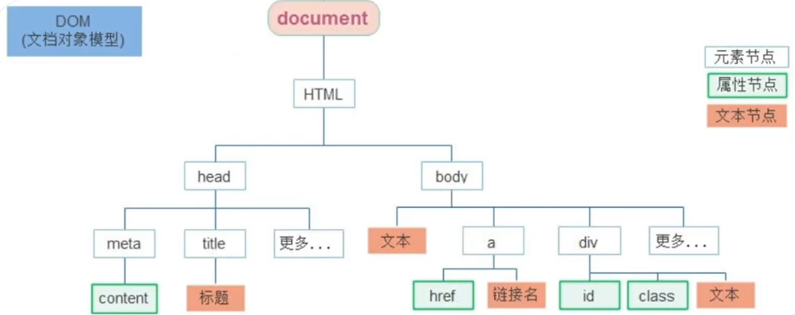
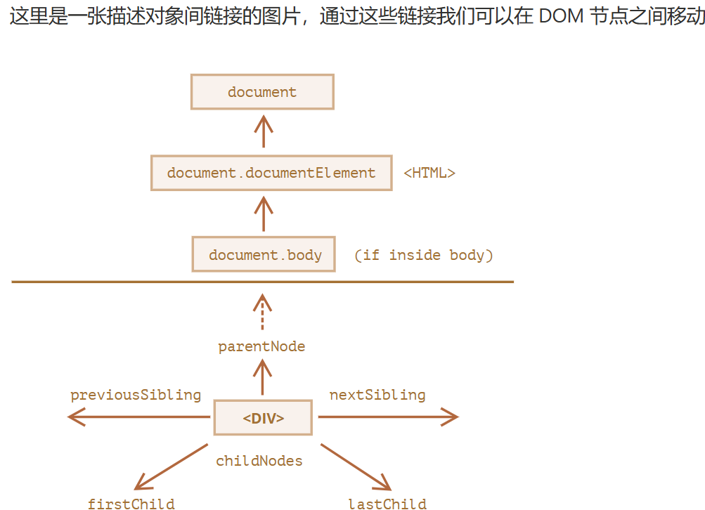
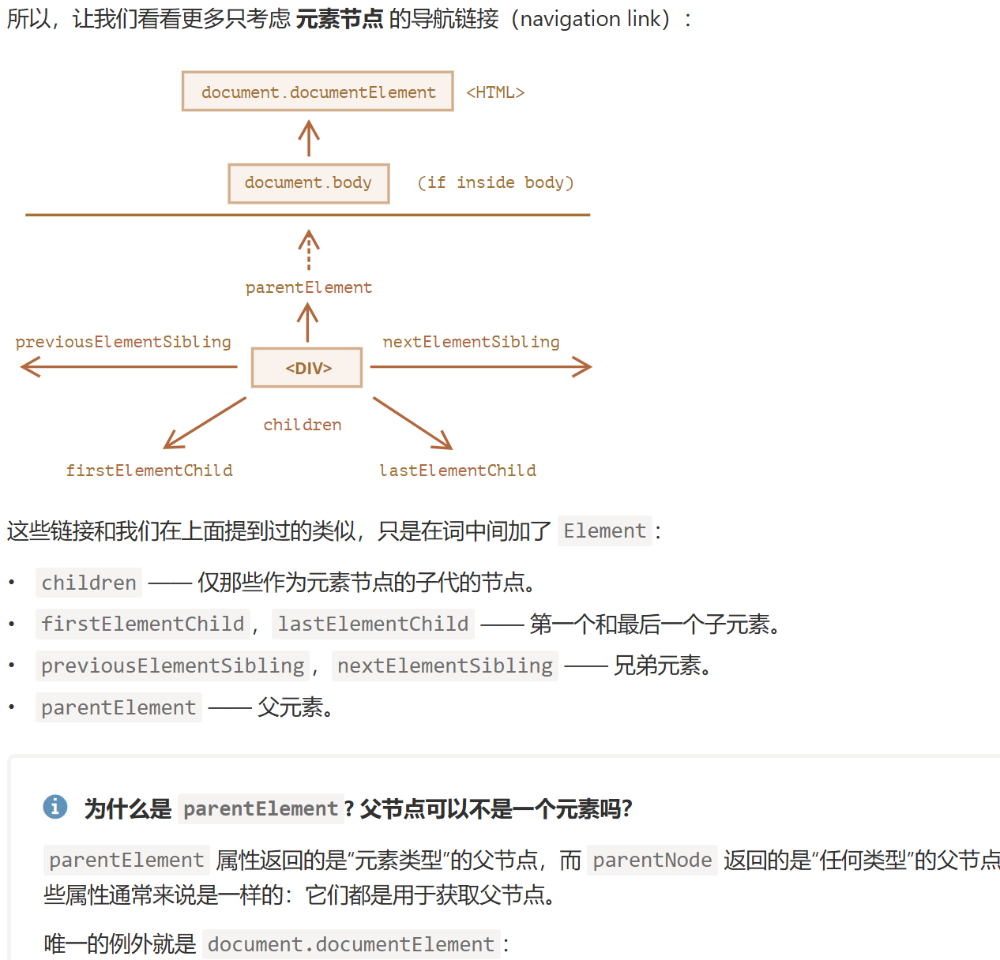
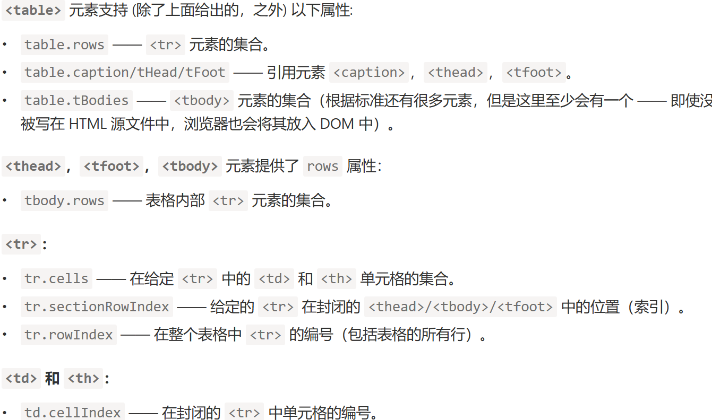
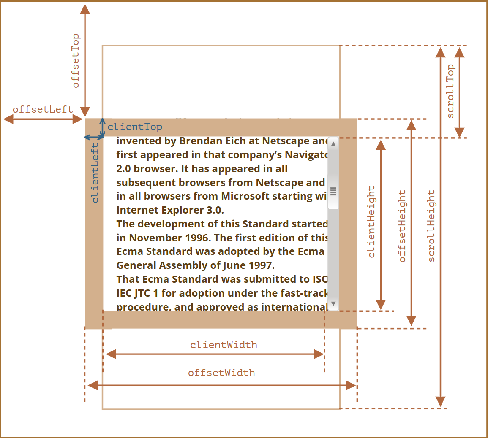
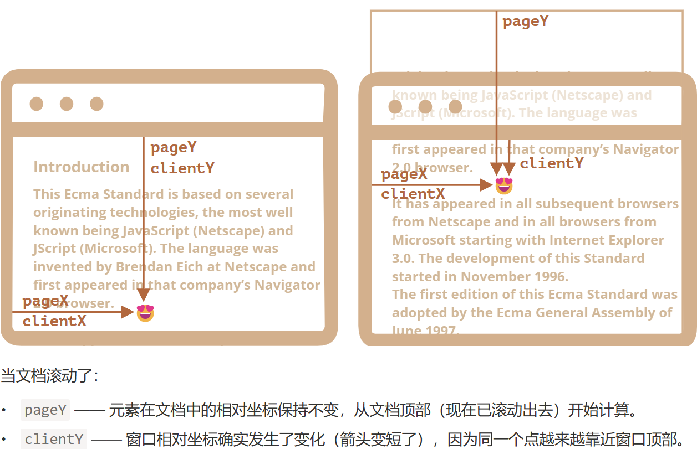
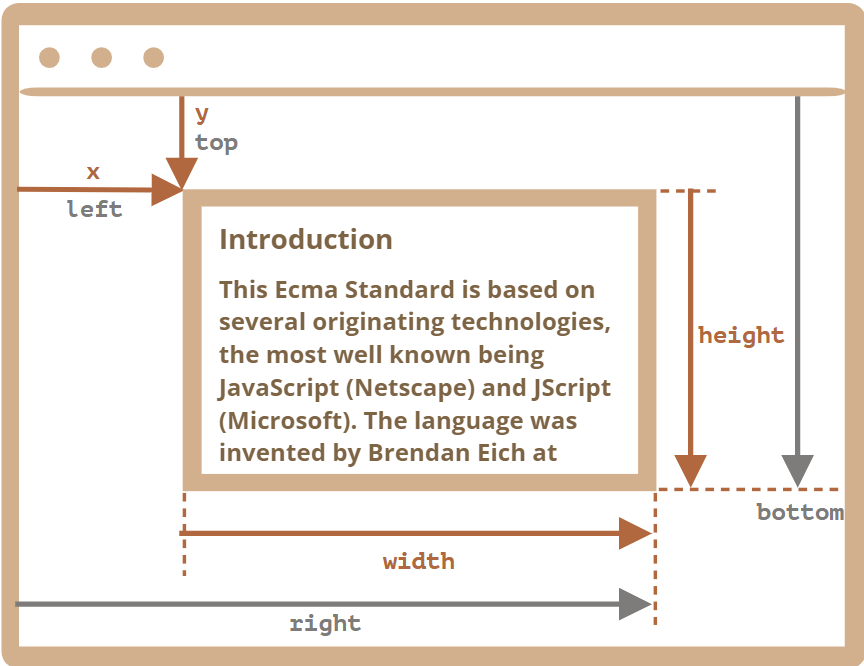
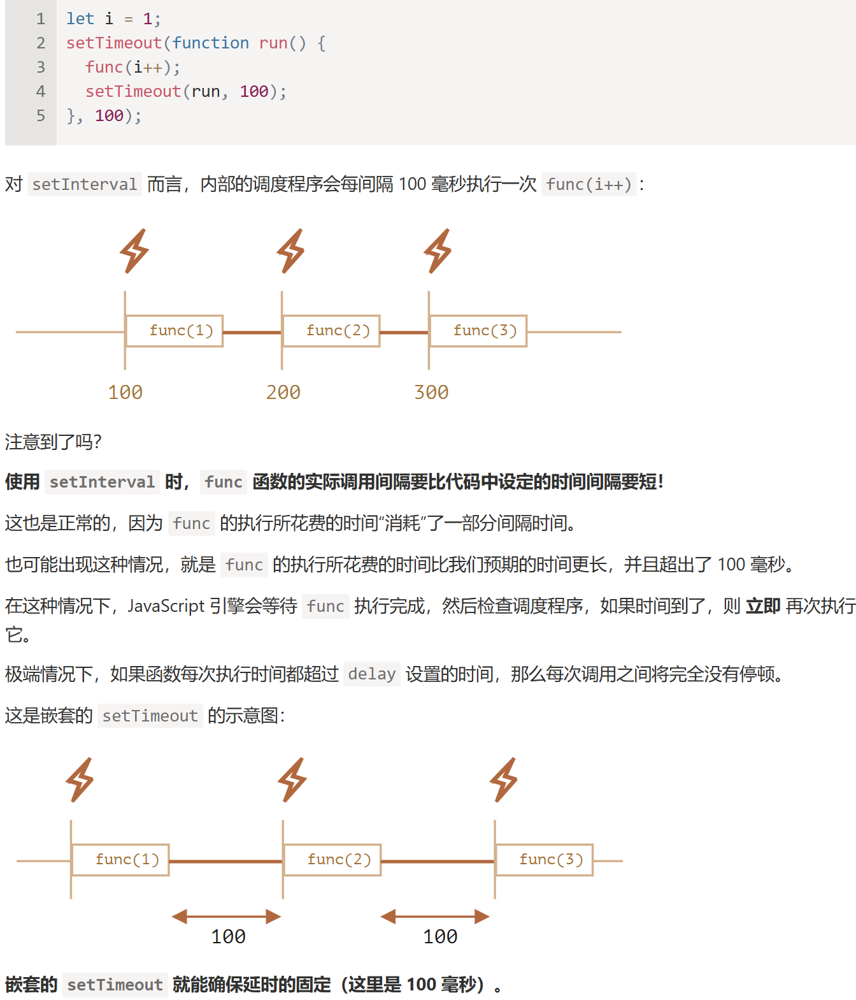

# 第一部分 DOM
> #### DOM树 
> 
> 
> 

**button的type属性有两值：button和submit。当不写type属性时，其type的默认值是submit，点击的话也会直接提交数据**

## 获取DOM元素
- 根据CSS选择器, 老方法用document.getElementBy..
- 选择匹配的第一个元素 `document.querySelector('CSS选择器')
- 选择匹配的所有元素 `document.querySelectorAll(..)
- 在控制台通过$0获取最后选中的元素，以此类推，如`$0.style.background = 'red' // 使选定的列表项（list item）变成红色`
- matches 检查elem是否与给定的CSS选择器匹配并返回布尔值，适用于遍历元素（如数组或其他内容）并试图过滤那些我们感兴趣的元素
	```
	for (let elem of document.body.children) {
		if (elem.matches('a[href$="zip"]')) {
		  alert("The archive reference: " + elem.href );
		}
	}
	```
- closest


## DOM节点属性 
- nodeType 查看节点是文本节点还是元素节点。它具有一个数值型值：1表示元素，3表示文本节点，其他一些则代表其他节点类型。只读。
- nodeName/tagName 用于元素名，标签名（除了 XML 模式，都要大写）。对于非元素节点，nodeName 描述了它是什么。只读。
	- tagName 仅受元素节点支持（因为它起源于 Element 类），而 nodeName 则可以说明其他节点类型。
- innerHTML 元素中的HTML内容。
- outerHTML 元素的完整HTML，就像innerHTML加上元素本身一样
	- 从DOM移除旧节点并将新的HTML插入其位置上，但元素（querySelector捕获的变量）的值不会变
- nodeValue/data 非元素节点（文本、注释）的内容。两者几乎一样，我们通常使用 data。可以被修改。
- textContent 元素内的文本：HTML减去所有`<tags>`。所有特殊字符和标签均被视为文本，防止不必要的HTML插入，比innerHTML更加安全
- hidden 当被设置为true时，执行与CSS`display:none`相同的事
- value
- href

### 修改元素属性 className style
- `img.src = '..'`
- `div.style.width = '300px'` 
	- style属性是个对象
	- 属性名有短横线换成驼峰命名 `div.style.backgroundColor='red'` 
- 通过类名	
	- 添加类名 `div.className='box'`
	- className容易覆盖之前的类名，故用classList更好：
		```
		item.classList.add('active')
		item.classList.remove('box')
		item.classList.toggle('active')	// 有就删去，没有加上
		```
- ★getComputedStyle
	- 无法使用 elem.style 读取来自 CSS 类的任何内容 `alert(document.body.style.marginTop); // 空的`
	- 但如果我们需要，例如，将 margin 增加 20px 呢？那么我们需要 margin 的当前值
	- 语法`getComputedStyle(element, [pseudo])` 第二参数: 伪元素（如果需要），例如`::before`
- 操作表单
	- item.value 
	- item.type
	- item.checked
- 表格table支持额外的属性，如`let td = table.rows[0].cells[1]; // 获取（第一行，第二列）`, form也有相关属性
	> 
	
### 自定义属性
DOM属性和方法的行为就像常规的JS对象一样
- 在 document.body 中创建一个新的属性title和新方法：
	```
	document.body.myData = {
	  name: 'Caesar',
	  title: 'Imperator'
	};
	alert(document.body.myData.title)
	document.body.sayTagName = function() {
	  alert(this.tagName);
	};
	document.body.sayTagName()
	```
- 注意，当一个元素有id或其他标准的特性，那么就会生成对应的**DOM属性**。但是上面创建的非标准的**HTML特性**则不会
- 所有特性都可以通过使用以下方法进行访问：
	- elem.hasAttribute(name) —— 检查特性是否存在。
	- elem.getAttribute(name) —— 获取这个特性值。
	- elem.setAttribute(name, value) —— 设置这个特性值。
	- elem.removeAttribute(name) —— 移除这个特性。
- dataset
	- 非标准的特性常常用于将自定义的数据从 HTML 传递到 JavaScript，或者用于为 JavaScript “标记” HTML 元素。
		```
		<div show-info="name"></div>
		<div show-info="age"></div>

		<script>	// 这段代码找到带有标记的元素，并显示需要的内容
		  let user = {
			name: "Pete",
			age: 25
		  };
		  for(let div of document.querySelectorAll('[show-info]')) {	// 在字段中插入相应的信息
			let field = div.getAttribute('show-info');
			div.innerHTML = user[field]; // 首先 "name" 变为 Pete，然后 "age" 变为 25
		  }
		</script>
		```
	- data-开头
	- 用dataset进行获取：`box.dataset.ownAttr`
	- 例如，如果一个 elem 有一个名为 "data-about" 的特性，那么可以通过 elem.dataset.about 取到它。
	- data-order-state 这样的多词特性可以以驼峰式进行调用：dataset.orderState


## 修改文档

### 创建元素
- document.createElement(tag) 用给定的标签创建一个新元素节点 `let div = document.createElement('div');`
- document.createTextNode(text) 用给定的文本创建一个文本节点
- 创建后，可以设置类名和内容：`div.className = "alert"; div.innerHTML = "<strong>Hi there!</strong>";`

### 插入页面
- node.append(...nodes or strings) —— 在 node 末尾 插入节点或字符串
- node.prepend(...nodes or strings) —— 在 node 开头 插入节点或字符串
- node.before(...nodes or strings) —— 在 node 前面 插入节点或字符串
- node.after(...nodes or strings) —— 在 node 后面 插入节点或字符串
- node.replaceWith(...nodes or strings) —— 将 node 替换为给定的节点或字符串
> 注意插入字符串时`< >`这样的符号都会被作转义处理: `div.before('<p>Hello</p>')  // &lt;p&gt;Hello&lt;/p&gt `
- elem.insertAdjacentHTML(where, html)已解决该问题
	- "beforebegin" —— 将 html 插入到 elem 之前
	- "afterbegin" —— 将 html 插入到 elem 开头
	- "beforeend" —— 将 html 插入到 elem 末尾
	- "afterend" —— 将 html 插入到 elem 之后
	- 第二个参数是 HTML 字符串，该字符串会被“作为 HTML” 插入

### 删除节点
- node.remove()
- 注意，所有插入方法都会自动从旧位置删除该节点

### 克隆节点
如何再插入一条类似的消息？ ———— 克隆现有的div，并修改其中的文本（如果需要）
- elem.cloneNode(true) 来创建元素的一个“深”克隆 —— 具有所有特性（attribute）和子元素
- elem.cloneNode(false)，克隆不包括子元素


## 节点操作

### 查找节点
- 父节点：`.parentNode`
- 子节点：`.children`
- 兄弟节点：previousElementSib

### 增加节点
- appendChild
- cloneNode

### 删除节点
- removeChild	`ul.removeChild(ul.children[0])`


## 大小/位置/滚动

### 元素~
https://zh.javascript.info/size-and-scroll#offsetparentoffsetlefttop
> 示意图
- offsetLeft/offsetTop 
	- 提供相对于 offsetParent 左上角的 x/y 坐标
	- offsetParent 最近祖先，渲染期间用于计算坐标。为①开启定位(position=absolute/relative/fixed/sticky) ②`<td> <th> <table>` ③`<body>`
	- 对以下元素，offsetParent的值为null: ①未显示的元素(display:none或不在文档中) ②`<body>和<html>` ③带有`position:fixed`的元素
- offsetWidth offsetHeight
- clientTop clientLeft
- clientWidth clientHeight 包括内容和padding (e.g.`centerX = document.documentElement.clientWidth/2 //窗口中心x坐标`)
- scrollWidth scrollHeight 还包括滚动出（隐藏）的部分
- scrollLeft/scrollTop 元素的隐藏、滚动部分的 width/height，可修改
> 不要从 CSS 中获取 width/height，因为CSS width/height 取决于另一个属性：box-sizing，其次，CSS 的 width/height 可能是 auto

### Window~
- 获取窗口window的宽度和高度: `document.documentElement.clientWidth/clientHeight`
> 不要使用window.innerWidth/innerHeight，因为包括了滚动条，一般我们只关注可用的窗口大小即滚动条内的大小
- 获取页面当前滚动: `window.pageXOffset/pageYOffset` (window.pageXOffset是window.scrollX的别名)
- 页面滚动至 相对于当前位置的 (x, y) 位置 scrollBy(x,y)
- 页面滚动至 绝对坐标 scrollTo(pageX,pageY)
- elem.scrollIntoView(top) top=true使elem出现在窗口顶部, top=false使elem出现在窗口底部
- 禁止滚动: `document.body.style.overflow = "hidden"` 恢复则设置""即可

### 坐标
- clientX/Y 相对于窗口，从窗口的顶部/左侧边缘计算得出
- pageX/Y 相对于文档，从文档的顶部/左侧边缘计算得出（加上已滚动的距离）
> 示意图

- elem.getBoundingClientRect() 返回最小矩形的窗口坐标
> 示意图
> x/y —— 矩形原点相对于窗口的X/Y坐标;  width/height —— 矩形的width/height（可以为负）
> 8个属性有关系：left = x; top = y; right = x + width; bottom = y + height;
>> 注意！坐标可能是小数，也可能是负数
>> 负的width/height值表示矩形从其右下角开始，向左上方“增长”；但实际上getBoundingClientRect()总是返回正数
>> 坐标的right/bottom与CSS position属性不同，CSS定位中，right表示距右边缘的距离，而bottom表示距下缘的距离

- document.elementFromPoint(x, y) 的调用会返回在窗口坐标 (x, y) 处嵌套最深的元素
	- ！ 对于在窗口之外的坐标，elementFromPoint返回null，注意检查

----------------------------------------------------------------------------
# 第二部分 BOM
下辖对象：navigator location document history screen

### 延时函数 setTimeout/setInterval
- 仅执行一次，可省略window.
- `setTimeout(sayHi, 1000, "Hello", "John")` 后面跟函数的参数
- 清除： `clearTimeout(timer)`
- 周期性调度有两种方式。一种是使用 setInterval，另外一种就是嵌套的 setTimeout
	```
	let timerId = setTimeout(function tick() {
	  alert('tick');
	  timerId = setTimeout(tick, 2000); // (*)
	}, 2000);
	```
	- 嵌套的 setTimeout 要比 setInterval 灵活得多。这种方式可以根据当前执行结果来调度下一次调用，因此下一次调用可以与当前这一次不同
> ##### 嵌套的 setTimeout 相较于 setInterval 能够更精确地设置两次执行之间的延时
> 

### location对象
拆分并保存URL地址的各个组成部分
- 案例：5秒后自动跳转。
- 利用location.href设置跳转链接

### navigator对象
记录与浏览器自身有关的信息

### history对象
管理历史记录，与浏览器地址栏的操作对应如前进后退历史记录


## 本地存储
页面刷新数据不丢失，数据存在用户浏览器中

### localStorage
- `localStorage.setItem('key', 'value')`
- `localStorage.getItem('key')`
- `localStorage.removeItem('key')`

### sessionStorage


--------------------------------------------------------------
# 第三部分 事件

## 事件基本概念和原理

### 事件监听
事件触发时候会经历三个阶段：①事件捕获阶段    ②执行阶段（执行当前元素的注册事件）   ③事件冒泡阶段。
https://www.cnblogs.com/WangYujie1994/p/10246100.html#:~:text=%E5%9C%A8%E7%B1%BB%E4%BC%BC%E4%BA%8Earcgis
- dispatchEvent() <=> addEventListener() (onclick等onMethod已经落后）

### 事件流 冒泡和捕获
- addEventListener第三个参数若为true则表示在事件捕获阶段触发（较少使用）
- 阻止冒泡（避免事件影响父级元素,也影响捕获，即阻断事件流）：eventobj.stopPropagation()

### 事件解绑
- on事件： 如令`btn.onclick = null`
- addEventListener: 用removeEventListener
- **! 匿名函数无法解绑 **

### ★事件委托
同时给多个元素注册事件，减少注册次数，提高性能；利用事件冒泡实现
- 给父元素注册即可实现
- 用`if e.target.tagName === 'sonName'`让只点击子元素时才执行事件，否则点击父元素也会执行
> 注意几个例子：https://zh.javascript.info/event-delegation

### ★环境变量this
- 代表当前函数运行时所处的环境
- 直接调用函数即window.function,所以this指代window
- 一般而言，谁调用this就是谁，但可以修改
- 箭头函数没有this
	- 默认绑定外层this的值
	- 向外层一层一层找直到找到this
- 严格模式下普通函数调this为undefined
- 改变this
	- call() 仅了解，`f.call(f函数运行时指定的this值, ...f函数的参数)`
	- apply() 


## 事件列表
- 鼠标事件
	- click
	- contextmenu 右键点击元素
	- mouseover/mouseout
	- mousedown/mouseup
	- mousemove
	- ...
- 键盘事件
	- keydown/keyup
	- ...
- 表单事件
	- submit 提交了一个form时
	- focus 聚焦于一个元素时如聚焦于一个input
	- ...
- 其它
	- DOMContentLoaded —— 当 HTML 的加载和处理均完成，DOM 被完全构建完成时
	- transitionend —— 当一个 CSS 动画完成时
	
### 浏览器默认事件
- 阻止默认行为
	- event.preventDefault()
	- addEventListener 可选项passive: true （更加流畅，因为上面的需要先运行函数才能调用preventdefault）

### 鼠标事件
> 单个动作触发多个事件时，事件的顺序是固定的，即遵循 mousedown → mouseup → click 的顺序
- event.button 使用button属性来区分是左键单击还是右键单击。左中右对应值：0/1/2
- 组合键 
	- shiftKey: Shift 
	- altKey: Alt （Mac 是 Opt）
	- ctrlKey: Ctrl
	- metaKey：对于 Mac 是 Cmd
	- `if (event.altKey && event.shiftKey) // 需同时按下Alt+Shift+click才有效`
	> (跨平台)Mac的cmd等同于win的ctrl，则代码中应当使用`if (event.ctrlKey || event.metaKey)`从而跨平台支持Ctrl+click
	
### 移动端触屏事件
- touchstart
- touchmove
- touchend

### 指针事件
综合鼠标和移动端事件的现代方案 https://zh.javascript.info/pointer-events

### 页面加载事件
- 加载外部资源如图片、外联css等执行完毕后触发的事件
- load
	```
	window.addEventListener('load', function(){ })
	// 这样即使把js代码写在head部分也可以正确执行了
	// 针对某个资源（如大图片） img.addEventListener('load',
	```
- DOMContentLoaded html节点加载完后即执行，无需等样式表和图片完成加载

### 元素滚动事件
- scroll 
	- `window.addEventListener('scroll', function(){ })`
	- scrollLeft scrollTop 获取元素内容往左/往上移出看不见的距离
	- 页面滚动使用html`document.documentElement.scrollTop`
	- 点击返回页面顶部 设置为0即可
	- scrollT(0,1000)

### 页面尺寸事件
- clientWidth clientHeight 获取元素宽高
- offsetWidth offsetHeight 包含padding和border，且是可视宽高
- offsetLeft offsetTop 只读属性，获取元素位置，注意以最近带有定位的父元素为准（类似绝对定位，都没有以文档左上为准）

### 表单事件
- 获取表单
	- `document.forms.my;  // name="my" 的表单`
	- `document.forms[0];  // 文档中的第一个表单`
- 获取表单中的元素
	- 集合form.elements: `form.elements.elementName`
	- 遇到多个相同名字的元素，结果是一个集合
	- 一个表单内会有一个或多个`<fieldset>`子表单元素，也具有elements属性: `fieldset.elements.login == form.elements.login //true`
	- 更简短的表示方式: 通过`form[index/name] or form.eleName`访问元素; 
		- 但修改元素name，仍然可以被旧的name访问到: `form.login.name = "username" //修改  form.username == form.login //true`
- 反向引用 对于任何元素，其对应的表单都可以通过element.form访问到
- 表单元素（控件）
	- input textarea
		- .value
		- .checked
	- select
		- .options —— `<option>`的子元素的集合
		- .value —— 当前所选择的option的value
		- .selectedIndex —— 当前所选择的option的编号
		```
		// 下面这三行做的都是同一件事
		  select.options[2].selected = true;
		  select.selectedIndex = 2;
		  select.value = 'banana';
		// 请注意：选项编号是从零开始的，所以编号 2 表示的是第三项
		// multiple特性
		<select id="select" multiple>
			<option value="blues" selected>Blues</option>
			<option value="rock" selected>Rock</option>
		</select>
		```
		- multiple特性
		
	#### focus/blur
	
	#### 数据更新事件
	- change
	- input
	- cut
	- copy
	- paste
	
	#### 提交表单submit
	- 提交表单主要有两种方式：
		- 第一种 —— 点击 <input type="submit"> 或 <input type="image">。
		- 第二种 —— 在 input 字段中按下 Enter 键。
		> 在输入框中使用Enter发送表单时，会在`<input type="submit">`上触发一次click事件（虽然实际上根本没有点击）
	- 手动提交：form.submit() 不会产生 submit 事件
		
### 自定义事件
https://zh.javascript.info/dispatch-events	

> ##### swiper插件网站


----------------------------------------------------------------------
# 第 部分 性能优化和杂项

## 防抖
```
// 1. 声明定时器变量 2. 每次事件触发时先判断是否打开timer 3. 若无则开启
function debounce(fn, t) {
	let timer
	return function () {
		if (timer) clearTimeout(timer)
		timer = setTimeout(function () {
			fn()
		}, t)
	}
}
element.addEventListener('mousemove', debounce(fn, 500))
// ！！为什么要返回匿名函数？因为debounce()只执行一次，需要function () {}这样的才能不断执行
```

## 节流
```
function throttle(fn, t) {
	let timer = null
	return function () {
		if (!timer) {
			timer = setTimeout(function () {
				fn()
				timer = null
			}, t)
		}
	}
}
element.addEventListener('mousemove', throttle(fn, t))
```
