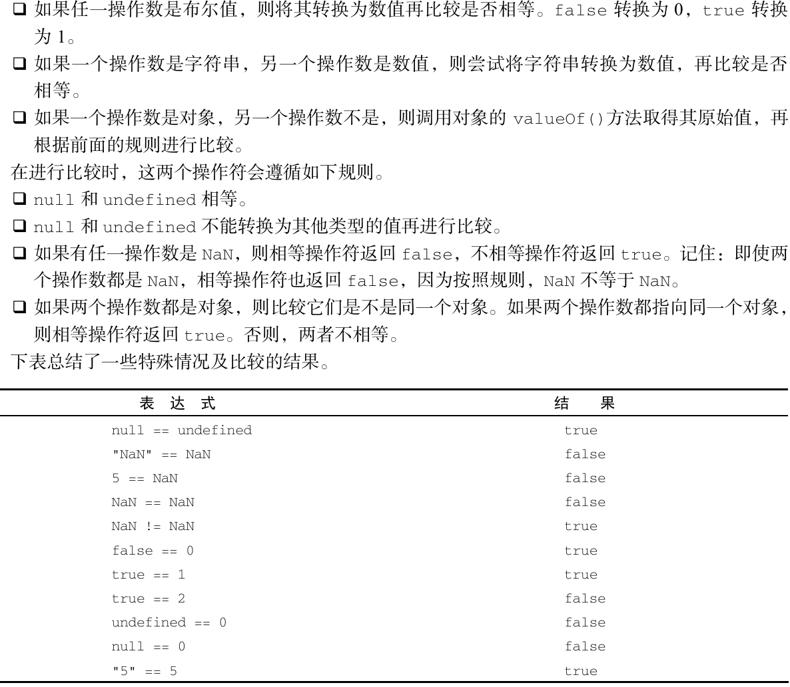
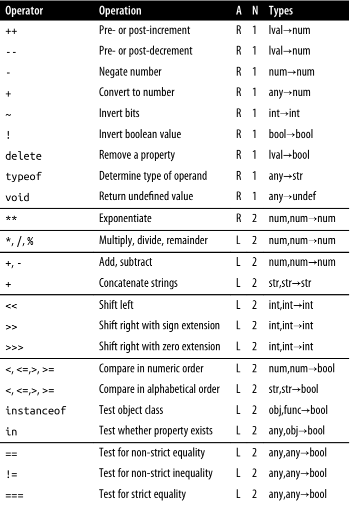
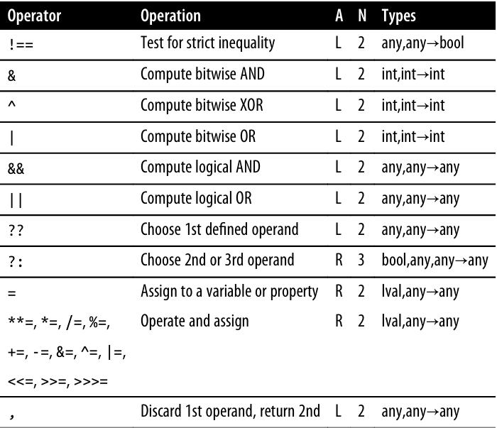
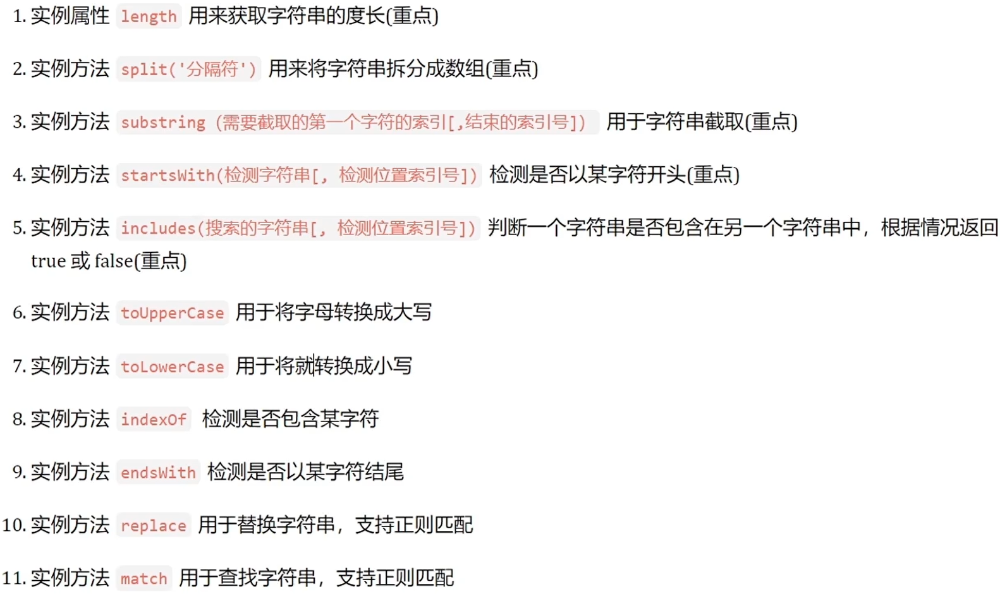
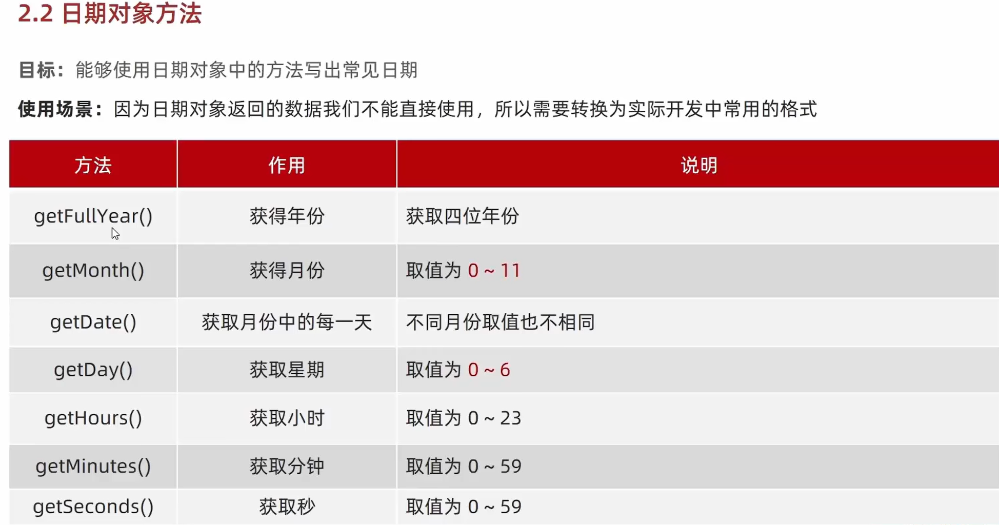
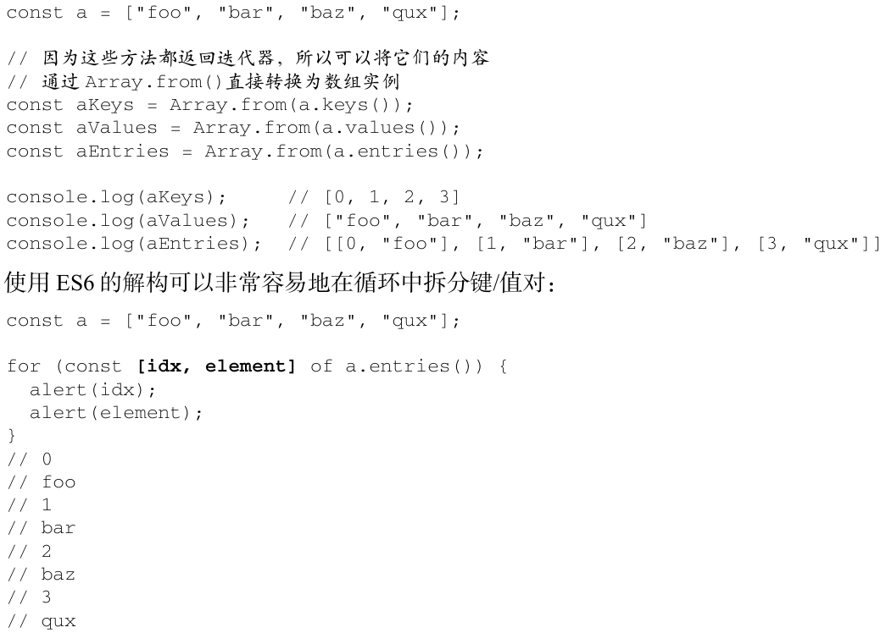

# JS手记 BY LJJ

--------------------------------------------------------------------------
# 【第一部分】 语法基础

- 交互输出
	- alert('')	弹窗
	- console.log('') 控制台
	- document.write('') 写入网页
	- result = prompt(title, [default]) 显示一个带有文本消息的模态窗口，还有输入框和确定/取消按钮，default指定输入框的初始值，result获取到输入的文本
	- result = confirm(question) result中保存结果，值为true或false
	
## 1.1 变量
- let和var
	- let变量有块作用域（如if），而var是函数作用域
	- let不允许同一块作用域里出现冗余声明，而var可以多次声明同一变量
	- let不会进行变量提升，而var可以（关键字声明的变量会自动提升到函数作用域顶部，如未赋过值则为undefined）
	- 省略var可以创建全局变量（不推荐）
- const
	- const 的行为与 let 基本相同，唯一一个重要的区别是用它声明变量时必须同时初始化变量
	- 且尝试修改const声明的变量会导致运行时错误。
	- 可以用于每次迭代创建一个新变量，用于for-in或for-of语句：
		```
		for (const value of [1,2,3,4,5]) { 
		  console.log(value); 
		} 
		// 1, 2, 3, 4, 5 
		```
	> 使用 const 声明可以让浏览器运行时强制保持变量不变，也可以让静态代码分析工具提前发现不合法的赋值操作。
	> 因此，很多开发者认为应该优先使用 const 来声明变量，只在提前知道未来会有修改时，再使用let。
	> 这样可以让开发者更有信心地推断某些变量的值永远不会变，同时也能迅速发现因意外赋值导致的非预期行为。
- 可以同时声明多个变量，用逗号隔开
- JS变量存的是值的地址


## 1.2 基本数据类型

- 类型检查：`typeof variable`
	- 6种简单数据类型（也称为原始类型）：Undefined、Null、Boolean、Number、String和Symbol(ES6新增)
	- 1种复杂数据类型Object
	> **注意！**
	> typeof是一个操作符，不是函数，不需要参数（但可以使用参数），即`typeof xxx`和`typeof(xxx)`均可
	> 严格来讲，函数function在ES中被认为是对象，并不代表一种数据类型。但函数也有特殊的属性，因而有必要通过typeof来区分函数和其他对象
	> typeof null 返回的是"object"，因为null被认为是对空对象的引用

### ·   数
- 数值Number
	- JS中所有整数和浮点数都是Number类型
	- Infinity
		- e.g. 1 / 0 
		- isFinite()函数
	- NaN 表示本来要返回数值的操作失败了（而不是抛出错误）
		- e.g. 0 / 0 , alert("not a number" / 2)
		- `console.log(NaN == NaN); // false `
		- isNaN()函数
			```
			console.log(isNaN(NaN));     // true 
			console.log(isNaN(10));      // false，10 是数值 
			console.log(isNaN("10"));    // false，可以转换为数值10 
			console.log(isNaN("blue"));  // true，不可以转换为数值 
			console.log(isNaN(true));    // false，可以转换为数值1 
			```
			> isNaN()可用于测试对象。首先会调用对象的valueOf()方法，然后确定返回的值是否可转换为数值。若不能，再调用toString()方法并测试其返回值
	- 可以使用下划线_作为分隔符 `let billion = 1_000_000_000;`
	-  10 亿写成 "1bn"，或将 73 亿写成 "7.3bn"
	- 科学计数法：`let billion = 1e9;  // 10 亿   let mcs = 1e-6; // 1 微秒`
- 大整数BigInt
	- 在整数后加后缀"n"
	- 可以表示的数无限大（只要不爆内存）
	```
	BigInt(Number.MAX_SAFE_INTEGER)     // => 9007199254740991n
	let string = "1" + "0".repeat(100); // 1 followed by 100 zeros
	```
	
### ·   字符串
- String
	- 字符串可以使用双引号（""）、单引号（''）或反引号（``）标示
	- 字符字面量：\n换行 \t制表 \b退格 \r回车 \f换页 \xnn以十六进制编码nn表示的字符 \unnnn以十六进制编码nnnn表示的Unicode字符
	- 字符串是**不可变的**（immutable）
- 模板字面量：保留换行字符，可以**跨行定义字符串**（单双引号则不能）
	```
	let Template = `first line 
	second line`; 
	// 等同于'first line\nsecond line'
	```
	- 模板字面量在定义模板时特别有用，比如下面这个HTML模板
		```
		let pageHTML = `  
		<div> 
		  <a href="#"> 
			<span>Jake</span> 
		  </a> 
		</div>`; 
		```
	- 注意空格
		```
		// 这个模板字面量在换行符之后有25个空格符 
		let myTemplateLiteral = `first line  
								 second line`;
		```
	- ★ 可用模版`${}`将变量用作字符串，立即求值并转换：`str = '${name}'`
		```
		let name = "Bill"; 
		let greeting = `Hello ${ name }.`;  // greeting == "Hello Bill."
		```
	- 标签函数(tag function)

### ·   其它类型
- Boolean
- Null （typeof null = object，注意**使用typeof无法检查出空值**）
	- 用等于操作符（==）比较null和undefined始终返回true
	- **任何时候，只要变量要保存对象，而当时又没有那个对象可保存，就要用null来填充该变量！**
- Undefined：声明却没有赋值时 （typeof undefined = undefined字符串），typeof未声明和未初始化的变量的结果都是undefined
- Symbol：创建唯一的标识 （typeof symbol = symbol字符串）

### ·   类型转换
- toString() （注意原有变量类型不改变【JS字面量特性】，即需要通过赋值：`a = a.toString()`）
- String()函数 （同样的，`b = String(b)`）
	- toString对null和undefined会报错，String可以解决
	- 对于拥有toString方法的值调用String时，实际上调用其toString方法
	> **数字加前导0**：String.prototype.padStart()
	> e.g. String(5).padStart(2, '0') // '05'
- **★ Number()函数 / 其它类型转数字**
	- 字符串 e.g. Number("011")返回11（十进制）, Number("1.1")返回1.1
	- 对于不合法的数字，则转换为NaN
	- 空字符串或全是空格，则转换为0
	- 布尔值true为1，false为0
	- null转换为0；undefined转换为NaN
	- 对象，调用valueOf()，并按上述规则转换返回的值。如果转换结果是NaN，则调用toString()，再按转换字符串的规则转换
		- 对象（包括数组）会首先被转换为相应的基本类型值，如果返回的是非数字的基本类型值，则再遵循以上规则将其强制转换为数字。
	- Symbol 类型的值不能转换为数字，会报错。
- parseInt() 字符串-->整数
- parseFloat() 字符串 --> 浮点数
- Boolean()函数 （**0、NaN、null、undefined是false其余为true; 只有空串是false, "0"是true**）
- ※ Object和基本类型互转（见DefinitiveGuide p49）
- 其它
	```
	let n = 123456.789;
	n.toFixed(0)         // => "123457"
	n.toFixed(2)         // => "123456.79"
	n.toFixed(5)         // => "123456.78900"
	n.toExponential(1)   // => "1.2e+5"
	n.toExponential(3)   // => "1.235e+5"
	n.toPrecision(4)     // => "1.235e+5"
	n.toPrecision(7)     // => "123456.8"
	n.toPrecision(10)    // => "123456.7890"
	```

> #### 【自动类型转换】
>	```
>	a = 10 - '5'	// 10-5
>	a = 10 + null	// 10+0			null变成0
>	a = 6 - undefined	// 6- NaN	undefined变成NaN
>	alert( Number("123z") );      // NaN（从字符串“读取”数>字，读到 "z" 时出现错误）
>	+a							// 加号可将a自动转换成数值
>	
>	a = 'hello' + 'world'
>	a = '1' + 2		// "12"
>	a = true + ''	// "true" 比String()更实用的方法
>	
>	!!age			// Boolean(x)
>	
>	let octal = "0o" + n.toString(8);   // octal == "0o21"
>	let hex = "0x" + n.toString(16);    // hex == "0x11"
>	```
 
> #### 【Destructuring Assignment】
>	```
>	let [x,y] = [1,2];  // Same as let x=1, y=2
>	[x,y] = [x+1,y+1];  // Same as x = x + 1, y = y + 1
>	[x,y] = [y,x];      // Swap the value of the two variables
>	[x,y]               // => [3,2]: the incremented and swapped values
>	// 用于函数输出
>	let [r,theta] = toPolar(1.0, 1.0); 
>	```
	
	
## 1.3 运算和操作符operators

### 位操作符
- ~ 按位取反，数值上即符号相反并减去1
- & 按位与
- | 按位或
- ^ 按位异或
- << 左移，右端补零
- >> 右移，有符号，即保留符号不变，是左移的逆运算
- >>> 无符号右移，左端包括符号位补零，不能用于BigInt

### 布尔逻辑操作符 `! && ||`
- ★ ||常用于选择第一个真值(0是falsy value): ` let max = maxWidth || preferences.maxWidth || 500 ` 
	- 用于操作数是一个有副作用的表达式: `operation || alert("not printed");`
- &&骚操作：`(a === b) && stop();   //  即if (a === b) stop();`
	- 即返回第一个假值，如果没有假值就返回最后一个值
	- 区别就是与运算返回第一个假值，而或运算返回第一个真值
		
### 空值合并运算符 `??`
- 如果第一个参数不是 null/undefined，则 ?? 返回第一个参数。否则，返回第二个参数
- ?? 的常见使用场景是提供默认值: `let user; alert(user ?? "匿名");  // 匿名, user未定义`
- 与`||`对比: `||`无法区分false、0、""和null/undefined，`??`返回第一个已定义的值
- ??= 只有当变量的值为null或者undefined才赋值（ `a??b`等同于`(a !== null && a !== undefined) ? a : b`）
	```
	let max = maxWidth ?? preferences.maxWidth ?? 500;
	// 若maxWidth有定义, 则把它作为值. 否则往后找，如果也没有定义, 则用最后的常数.
	let options = { timeout: 0, title: "", verbose: false, n: null };
	options.title ?? "Untitled" // => "": as defined in the object
	options.verbose ?? true     // => false: as defined in the object
	options.quiet ?? false      // => false: property is not defined
	options.n ?? 10             // => 10: property is null
	// 与&&或||混用时必须加括号
	a ?? b || c     // SyntaxError: parentheses are required
	```
### 杂项
- 条件操作符 `var = bool_exp ? true_val : false_val;`
- 值的比较
	- 对不同类型的值进行比较时，JS会首先将其转化为数字（number）再判定大小
		```
		alert( '2' > 1 ); // true，字符串 '2' 会被转化为数字 2
		alert( '01' == 1 ); // true，字符串 '01' 会被转化为数字 1
		```
- ★ 相等`==` <--> 全等`===`（值和类型均相同，因为**比较相等时不转换操作数**，推荐使用）
	- e.g. `var x = "5"; x == 5;`TRUE  <=>  `var x = "5"; x === 5;`FALSE
	> 规则：
	> 
	> null === undefined 为false
	> NaN !== NaN 为 true
	> alert( null >= 0 ); // true,当使用数学式或其他比较方法 `< > <= >=` 时, null被转化为0, undefined被转化为NaN
	> 除了严格等===外，其他但凡有undefined/null参与的比较，都需要格外小心。对于取值可能是null/undefined的变量，请按需要分别检查它的取值情况
	> ** Object.is() 与比较操作符 “===”、“==” 的区别 **
		- ● 使用双等号（==）进行相等判断时，如果两边的类型不一致，则会进行强制类型转化后再进行比较。
		- ● 使用三等号（===）进行相等判断时，如果两边的类型不一致时，不会做强制类型准换，直接返回 false。
		- ● 使用 Object.is 来进行相等判断时，一般情况下和三等号的判断相同，它处理了一些特殊的情况，比如 -0 和 +0 不再相等，两个 NaN 是相等的。
- `b = '123'; b = +b`可将字符串转为数字
- ES7新增乘方符`**`和`**=`以取代`Math.pow()`
- eval("3+2")    // => 5

> #### JS operators
> 
> 

	
## 1.4 语句statement `if/switch/while/for`
- switch
	```
	switch (i) {  
	  case 25: 
		console.log("25"); 
		break; 
	  case 35: 
		console.log("35"); 
		break; 
	  default: 
		console.log("Other"); 
	} 
	```
	- switch和case后也可以跟字符串进行判断
	- case后的条件判断可以是跟if一样的表达式，即可以是一个“范围”
	- switch语句在比较每个条件的值时会使用全等操作符，因此不会强制转换数据类型（比如字符串"10"不等于数值10），即相等是严格相等
- *for in* : `for (const x in array){...}` 枚举对象中的非符号键属性
	- 控制语句中的const也不是必需的。但为了确保这个局部变量不被修改，推荐使用const
	- 对象的属性是无序的，因此for-in语句不能保证返回对象属性的顺序
- *for of* 用于遍历可迭代对象的元素
	- `for (const el of [2,4,6,8]) { document.write(el); }`
	- for-of 循环会按照可迭代对象的next()方法产生值的顺序迭代元素; 如果尝试迭代的变量不支持迭代，则会报错
- 标签语句
	- e.g. `start: for (let i = 0; i < count; i++) { console.log(i); }`
	- start是一个标签，可以在后面通过break或continue语句引用。标签语句的典型应用场景是嵌套循环。 
		```
		let num = 0; 
		outermost: 
		for (let i = 0; i < 10; i++) { 
		  for (let j = 0; j < 10; j++) { 
			if (i == 5 && j == 5) { 
			  break outermost; 
			} 
			num++;  
		  } 
		} 
		console.log(num); // 55 
		```
- with 将代码作用域设置为特定的对象
	```
	let qs = location.search.substring(1); 
	let hostName = location.hostname; 
	let url = location.href; 
	// 上面代码中的每一行都用到了location对象。如果使用with语句，就可以少写一些代码： 
	with(location) {  
	  let qs = search.substring(1); 
	  let hostName = hostname; 
	  let url = href; 
	} 
	```
	- ! 严格模式不允许使用with语句; 由于with语句影响性能且难于调试代码，通常不推荐在产品代码中使用

	> #### JavaScript statements
	> 

## 1.5 杂项
- 严格模式
	- 语法：`"use strict"`
	- 一般放在脚本文件开头。也可以被放在函数体的开头。这样则可以只在该函数中启用严格模式。
	- class和module会自动启用严格模式
- 垃圾回收
	- 策略一：标记清理（常用）
		- 从根部开始不可达的变量会被稍后清除（不包括根的连通分量）
		- 当变量进入上下文，比如在函数内声明某变量时，该变量会被加上存在于上下文中的标记
		- 而在上下文中的变量，逻辑上讲不应该释放它们的内存，因为只要上下文中的代码在运行就有可能用到。当变量离开上下文时，也会被加上离开上下文的标记。 
		- 垃圾回收时，会标记内存中所有变量（标记方法有很多种）。然后将所有上下文中的变量，以及被上下文引用的变量标记去掉。之后被加上标记的变量就是待删除的
	- 策略二：引用计数（几乎废弃）
- debugger;  // <-- 调试器会在这停止
- JSDoc：用法、参数和返回值。 编辑器使用这些注释来提供自动补全和一些自动化代码检查工作
	```
	/**
	 * 返回 x 的 n 次幂的值。
	 *
	 * @param {number} x 要改变的值。
	 * @param {number} n 幂数，必须是一个自然数。
	 * @return {number} x 的 n 次幂的值。
	 */
	function pow(x, n) {
	  ...
	}
	```

--------------------------------------------------------------------------
# 【第二部分】 对象、类和引用数据类型
除七种基本类型，其余都属于对象

## 2.1 对象
```
let obj = Object()	// 创建对象
let obj2 = {}		// 对象字面量创建对象
let obj3 = {
	name:"..", 
	age:18,
	["gender"]:"man"
	inner_obj:{
		x:xx,
		y:yy,
	}
}

obj.name = '..'

delete obj.name		// 删除属性

for (let proName in obj){
	console.log(proName, obj[proName])	// *** 打印属性名和属性值，注意不能用obj.proName调属性值，需用中括号形式 ***
}
let addr = "";							// 另一个例子
for(let i = 0; i < 4; i++) {
	addr += customer[`address${i}`] + "\n";
}
```

### 对象的创建
- new方法 ` let o = new Object(); `
- Object.create() `let o1 = Object.create({x: 1, y: 2});`

	> #### 原型prototype
	> 每个JS对象都有与之联系的第二对象，称之为原型，该对象的属性也继承自原型
	> 访问：`Object.prototype`
	> `new Object()` uses `Object.prototype`, `new Array()` uses `Array.prototype`, `new Date()` uses `Date.prototype`
	> `Date.prototype` inherits properties from `Object.prototype` (后者没有原型，为"顶级"原型)

### 对象属性的操作和访问
- 数据属性有4个特性描述它们的行为
	- Configurable 表示属性是否可以通过 delete 删除并重新定义，是否可以修改它的特性，以及是否可以把它改为访问器属性
	- Enumerable 表示属性是否可以通过for-in循环返回
	- Writable 表示属性的值是否可以被修改
	- Value 属性的值，默认值为undefined
	- 要修改属性的默认特性，就必须使用Object.defineProperty()方法：
		```
		// 接收3个参数：要添加属性的对象、属性名称和一个描述符对象(包含以上4种特性)
		Object.defineProperty(person, "name", { 
		    writable: false, 
		    value: "Nicholas" 
		});
		```
- 访问器属性
	```
	Object.defineProperty(book, "year", { 
	  get() { 
		return this.year_; 
	  }, 
	  set(newValue) { 
		if (newValue > 2017) { this.year_ = newValue; } 
	  } 
	});
	```
- Object.defineProperties() 定义多个属性
	```
	Object.defineProperties(book, { 
	  year_: { 
		value: 2017 
	  }, 
	  edition: { 
		value: 1 
	  }, 
	  year: { 
		get() { 
		  return this.year_; 
		}, 
		set(newValue) { 
		  if (newValue > 2017) { 
			this.year_ = newValue; 
			this.edition += newValue - 2017; 
		  } 
	    } 
	  } 
	}); 

	```
- Object.is() 弥补===无法正确判断的一些特殊情况
- 如果读取一个不存在的属性，不会报错，返回undefined
- 对象进行相等或全等比较时，比较的时内存地址，所以两种方式没有差别
- `const obj2 = obj` --> 给对象变量加const可以避免后期不小心对其修改，但仍可对对象的属性进行修改

### 属性是否存在：in关键字和hasOwnProperty()
	```
	let o = { x: 1 };
	"x" in o         			// => true: o has an own property "x"
	"y" in o         			// => false: o doesn't have a property "y"
	"toString" in o  			// => true: o inherits a toString property
	o.hasOwnProperty("x")        // => true: o has an own property x
	o.hasOwnProperty("y")        // => false: o doesn't have a property y
	o.hasOwnProperty("toString") // => false: toString is an inherited property
	```
	- 与!==的比较：大部分情况下可替换in，但如果故意将属性值设为undefined，则`o.x !== undefined`结果为false, `"x" in o`结果为true

### 对象的方法
	```
	let obj = {
		attr: '',
		method_name: function (){
			console.log();
		}
	}
	```
	- 注意无论是属性方法，多个间均用逗号隔开
	- 方法简写：`method_name() { }` 省略冒号和function
	- get & set
		```
		let p = {
			// x and y are regular read-write data properties.
			x: 1.0, y: 1.0,
			
			// r is a read-write accessor property with getter and setter.
			// Don't forget to put a comma after accessor methods.
			get r() { return Math.hypot(this.x, this.y); },
			set r(newvalue) {
				let oldvalue = Math.hypot(this.x, this.y);
				let ratio = newvalue/oldvalue;
				this.x *= ratio;
				this.y *= ratio;
			},
			// theta is a read-only accessor property with getter only.
			get theta() { return Math.atan2(this.y, this.x); }
		};
		p.r     	// => Math.SQRT2
		p.theta 	// => Math.PI / 4
		```
	- Object.keys(obj)
	- Object.values(obj)
	
### 对象的遍历Enumerating Properties
	```
	for (let k in obj){
		console.log(obj[k]);
	}
	```
	> 枚举顺序（JTDG p141）
	
### 对象的克隆
- Object.assign(obj, o) 把o对象拷贝给obj，例如可以给obj添加属性：`Object.assign(obj, {gender: male})`
- 对象的深拷贝
	- 递归法
	-  lodash 库的 _.cloneDeep(obj)
	
### 可选链 "?."
可选链 ?. 是一种访问嵌套对象属性的安全的方式。即使中间的属性不存在，也不会出现错误。
	
### ES6新增的扩展语法
- 属性简写： 如`name: name`现在只写`name`
- 可计算属性 [property_name]，即属性名可以根据变量的值动态变化
- 简写方法名： `sayName: function(name) { }`现在可以简写成`sayName(name) { }`
- copy the properties of an existing object into a new object `let rect = { ...position, ...dimensions };`


## 2.2上 基本引用类型
- 引用类型虽然有点像类，但跟类并不是一个概念。为避免混淆，本章后面不会使用术语“类”
- 新对象通过使用new操作符后跟一个构造函数（constructor）来创建。构造函数就是用来创建新对象的函数，如`let now = new Date(); `	

### 原始值包装类型
- 3种特殊的引用类型：Boolean、Number和String，被成为原始值包装类型
- 每当用到某个原始值的方法或属性时，后台都会创建一个相应原始包装类型的对象，可以使用各种方法

- Number 
	- num.toString(base) 括号中填进制
	- `123456..toString(36)` JS隐含了第一个点之后的部分为小数部分, 两个点则知道小数为空
	- 四舍五入方法： Math.floor向下舍入 ceil向上 round最近整数（四舍五入） trunc直接移除小数点后的所有内容
	- **toFixed(n)** 将数字四舍五入到小数点后n位，并以字符串形式返回结果；如果小数部分比所需要的短，则在结尾添加0
	- isNaN() `alert( NaN === NaN ); // false` → `alert( isNaN(NaN) ); // true`
	- isFinite()
	- parseInt() parseFloat() 
		- 从字符串中“读取”数字，直到无法读取为止。如果发生 error，则返回收集到的数字
		- 可选的第二个参数：指定进制 `alert( parseInt('0xff', 16) ); // 255`
	- Math.
		- random() 返回一个从 0 到 1 的随机数（不包括 1）
		- max()/min()
		- pow()
		- 三角函数等
- String
	- 查找子串
		- ★`str.indexOf(substr, pos)` 从给定位置 pos 开始，在 str 中查找 substr，如果没有找到，则返回 -1，否则返回子串起始位置
		- `str.includes(substr, pos)` 根据 str 中是否包含 substr 来返回 true/false
		- `"Widget".startsWith("Wid")  // true，"Widget" 以 "Wid" 开始`
		- `"Widget".endsWith("get")  // true，"Widget" 以 "get" 结束`
	- 获取子串
		- ★`str.slice(start [, end])` 返回字符串从start到end（不包括，可选）的部分；参数是负值意思是起始位置从字符串结尾计算
		- ★`str.substring(start [, end])` 与slice几乎相同，但允许start大于end(这时slice返回空串，substring仍能返回正确值)；不支持负参数
		- `str.substr(start [, length])` ：`str.substr(2, 4)  // 从位置 2 开始，获取 4 个字符`
	- 替换
		- ★`let replacement = str.replace('World', 'Kimi')`
	- 分割
		- ★`let parts = str.split(' '); // ['Hello', 'World']` 把字符串以分隔符为界分割成一个个子串放入数组
	- 串的比较
		- localeCompare()
	- ★str.repeat(n) —— 重复字符串 n 次
	- ★str.trim() —— 删除字符串前后的空格 
	- str.toUpperCase()/toLowerCase()
	> 

### Date
- 创建：`let now = new Date(); `	
	- 在不给Date构造函数传参数的情况下，创建的对象将保存当前日期和时间
	- 要基于其他日期和时间创建日期对象，必须传入其毫秒表示（UNIX纪元1970年1月1日午夜之后的毫秒数）。有两个辅助方法：
	- Date.parse()方法接收一个表示日期的字符串参数
		>  “月/日/年”，如"5/23/2019"； 
		>  “月名 日, 年”，如"May 23, 2019"；	 `let someDate = new Date(Date.parse("May 23, 2019"));`
		>  “周几 月名 日 年 时:分:秒 时区”，如"Tue May 23 2019 00:00:00 GMT-0700"； 
		>  ISO 8601扩展格式“YYYY-MM-DDTHH:mm:ss.sssZ”，如 2019-05-23T00:00:00（只适用于兼容ES5的实现）。 
		> 直接把表示日期的字符串传给Date构造函数，那么Date会在后台调用Date.parse(), 即也可：
		> 	`let someDate = new Date("May 23, 2019")` `new Date('2024-9-1 08:00:00')`
	- Date.UTC() 
		> 参数是年、月数（1月是0，2月是1，以此类推）、日（1~31）、时（0~23）、分、秒和毫秒
		> 年和月是必需的, 如果不提供日, 那么默认为1日。其他参数默认0
		> `let allFives = new Date(Date.UTC(2005, 4, 5, 17, 55, 55)); // GMT 时间2005 年5月5日下午5点55分55秒`
	-  Date.now()方法，返回表示方法执行时日期和时间的毫秒数。
		```
		let start = Date.now(); 	// 起始时间 
		doSomething(); 				// 调用函数 
		let stop = Date.now(), 		// 结束时间 
		result = stop - start; 
		```
- 打印日期
	- toLocaleString() - 2/1/2019 12:00:00 AM
	- toString() - Thu Feb 1 2019 00:00:00 GMT-0800 (Pacific Standard Time)
	> ##### 比较日期
		```
		let date1 = new Date(2019, 0, 1);    // 2019 年 1 月 1 日 
		let date2 = new Date(2019, 1, 1);    // 2019 年 2 月 1 日 
		console.log(date1 < date2); // true 
		console.log(date1 > date2); // false 
		```
	- 其它方法： toDateString() 周几、月、日、年 toTimeString() 时、分、秒和时区 toLocaleDateString() toLocaleTimeString() toUTCString()
- 日期对象方法
	> 
- 时间戳 1970年1月1日午夜之后的毫秒数
	- 方法一：Date().getTime()
	- 方法二：+new Date('2000-9-1 08:00:00') （其实是将字符串转换为了数字）
	- 方法三：Date.now() （只能得到当前的时间戳）
- 其它方法（见高级设计p106-7）

> #### 使用moment.js库
> `moment().format('YYYY-MM-DD HH:mm:ss')`的结果：2024-12-08 10:15:59


### RegExp

### 内置
- Global
- Math

### 对象解构
	```
	let options = {
	  title: "Menu",
	  width: 100,
	  height: 200
	};

	let {title, width, height} = options;
	```
	- 参考：https://developer.mozilla.org/zh-CN/docs/Web/JavaScript/Reference/Operators/Destructuring_assignment#%E8%A7%A3%E6%9E%84%E5%AF%B9%E8%B1%A1
	- 更改属性名称：
		```
		const o = { p: 42, q: true };
		const { p: foo, q: bar } = o;

		console.log(foo); // 42
		console.log(bar); // true

		```
## 2.2下 集合引用类型

### Array
- 创建
	- 构造函数：`let colors = new Array();`
		- 括号里加上数字可以指定长度
		- 直接指定元素：`let colors = new Array("red", "blue", "green"); 	`
	- 数组字面量：
		- `let colors = ["red", "blue", "green"];  // 创建一个包含3 个元素的数组`
		- 使用数组字面量初始化数组时，可以使用一串逗号来创建空位（hole）
			```
			const options = [,,,,,]; 		// 创建包含5 个元素的数组 
			console.log(options.length);   // 5 
			console.log(options);          // [,,,,,]
			// ES6新增方法普遍将这些空位当成存在的元素，只不过值为undefined
			// !注意, 由于行为不一致和存在性能隐患，因此实践中要避免使用数组空位。若确需，则可显式地用undefined值代替
			```
	- from()用于将类数组结构转换为数组实例 (详见高级设计p139)
		- `console.log(Array.from("Matt")); 	// ["M", "a", "t", "t"] `
	- of()把一组参数转换为数组: `console.log(Array.of(1, 2, 3, 4)); 	// [1, 2, 3, 4] `
- length
	- 通过修改length属性，可以从数组末尾删除（设置更小的值）或添加元素（设置更大的值，value为undefined）
	- 使用length 属性可以方便地向数组末尾添加元素：`colors[colors.length] = "black";`
- 检测数组
	- if (value instanceof Array) { }
	- if (Array.isArray(value)) { }
- 迭代器方法
	> 
- 常用方法
	- fill(x)用x填充数组 fill(x,y)用x填充索引大于等于y fill(x,y,z)用x填充索引`>=`y小于z。超出范围忽略
	- copyWithin()会按照指定范围浅复制数组中的部分内容，然后将它们插入到指定索引开始的位置
	- 打印方法：toLocaleString()、toString()和valueOf()
		- 其中，valueOf()返回的还是数组本身。而 toString()返回由数组中每个值的等效字符串拼接而成的一个逗号分隔的字符串
	- pop() push() shift()【删除数组的首项并返回它然后长度减1】
	- reverse() sort()
	- slice() 所有从索引 start 到 end（不包括 end）的数组项复制到一个新的数组
	- ★splice()
	- concat() 追加其它数组（甚至对象）
		```
		let colors = ["red", "green", "blue"]; 
		let colors2 = colors.concat("yellow", ["black", "brown"]); 
		console.log(colors);   // ["red", "green","blue"] 
		console.log(colors2);  // ["red", "green", "blue", "yellow", "black", "brown"] 
		```
		- **注意到concat是新建一个数组，而push是对于原数组**
	- 迭代方法
		- every()：对数组每一项都运行传入的函数，如果对每一项函数都返回true，则这个方法返回true。 
		- ★filter()：对数组每一项都运行传入的函数，函数返回true的项会组成数组之后返回。 
		- ★forEach()：对数组每一项都运行传入的函数，没有返回值。 
		- ★map()：对数组每一项都运行传入的函数，返回由每次函数调用的结果构成的数组（每个元素调用 func 的结果创建一个新数组）
		- some()：对数组每一项都运行传入的函数，如果有一项函数返回true，则这个方法返回true。
	- ★reduce() 常用于累加
	- indexOf/lastIndexOf 和 includes 类似字符串
	- find filter find 方法搜索的是使函数返回 true 的第一个（单个）元素。如果需要匹配的有很多，我们可以使用filter()，返回一个数组
	- ★from() 伪数组转换为真数组，静态方法
	...
	> JS判断是否是数组的四种做法 https://www.cnblogs.com/echolun/p/10287616.html

### 定型数组

### 迭代器
- 可以应用 for..of 的对象被称为 可迭代的
- 可迭代对象必须实现 Symbol.iterator 方法
- `obj[Symbol.iterator]()`的结果被称为 迭代器（iterator）
- 一个迭代器必须有 next() 方法
- Array.from 可以接受一个可迭代或类数组的值，并从中获取一个“真正的”数组 如`Array.from({0: "Hello", length: 1});`

### Map & WeakMap
- Map是一个带键的数据项的集合，就像一个Object一样。 但是它们最大的差别是Map允许任何类型的键，例如对象
- 从对象创建map：
	```
	let map = new Map([
	  ['1',  'str1'],
	  [1,    'num1'],
	  [true, 'bool1']
	]);
	```
- 方法和属性如下：
	- new Map() —— 创建 map。
	- map.set(key, value) —— 根据键存储值。
	- map.get(key) —— 根据键来返回值，如果 map 中不存在对应的 key，则返回 undefined。
	- map.has(key) —— 如果 key 存在则返回 true，否则返回 false。
	- map.delete(key) —— 删除指定键的值。
	- map.clear() —— 清空 map。
	- map.size —— 返回当前元素个数。
	- map.keys() —— 遍历并返回一个包含所有键的可迭代对象，
	- map.values() —— 遍历并返回一个包含所有值的可迭代对象，
	- map.entries() —— 遍历并返回一个包含所有实体 [key, value] 的可迭代对象，for..of 在默认情况下使用的就是这个
	- 直接用for...of语句获得[key, value]：`for (let [key, value] of map)`
- fromEntries `let obj = Object.fromEntries(map.entries()); // 创建一个普通对象`

- WeakMap 和 Map 的第一个不同点就是，WeakMap 的键必须是对象，不能是原始值
- WeakMap 只有以下的方法
	- weakMap.get(key)
	- weakMap.set(key, value)
	- weakMap.delete(key)
	- weakMap.has(key)
- 通常，当对象、数组之类的数据结构在内存中时，它们的子元素，如对象的属性、数组的元素都被认为是可达的，不会被垃圾回收，即便没有对它的引用了
- WeakMap 不支持迭代以及 keys()，values() 和 entries() 方法
- WeakMap 的主要应用场景是额外数据的存储 “数据与这个对象共存亡”
	- `weakMap.set(john, "secret documents");  // 如果john消失，secret documents将会被自动清除`
- 另外一个常见的例子是缓存


### Set & WeakSet
- Set 是一个特殊的类型集合 —— “值的集合”（没有键），它的每一个值只能出现一次
- 方法
	- new Set(iterable) —— 创建一个 set，如果提供了一个 iterable 对象（通常是数组），将会从数组里面复制值到 set 中。
	- set.add(value) —— 添加一个值，返回 set 本身
	- set.delete(value) —— 删除值，如果 value 在这个方法调用的时候存在则返回 true ，否则返回 false。
	- set.has(value) —— 如果 value 在 set 中，返回 true，否则返回 false。
	- set.clear() —— 清空 set。
	- set.size —— 返回元素个数。
	- const myArr = Array.from(mySet1);  // 使用 Array.from 将 Set 对象转换为数组对象


## 2.3 原型和继承


## 2.4 类
“虽然ES6类表面上看起来可以支持正式的面向对象编程，但实际上它背后使用的仍然是原型和构造函数的概念”

### 定义
- 两种方式: 类声明`class Person {}` 类表达式`const Animal = class {}; `  
	```
	class MyClass {
	  // class 方法
	  constructor(name) {
		this.name = name;
	  }
	  method1() { ... }
	  method2() { ... }
	  ...
	}
	```
	

--------------------------------------------------------------------------
# 【第三部分】 函数
函数名就是指向函数的指针，所以它们跟其他包含对象指针的变量具有相同的行为，例如一个函数可以有多个名称

## 函数基础
- 声明
- 局部变量
- 参数
	- 默认值：`function showMessage(from, text = "no text given") { }`
	- 也可为表达式`function f(from, text = anotherFunction()) {}`
	- 也可用`if (argument===undefined)`(过去的做法)或者`alert(count ?? "unknown")`实现默认值
- 函数表达式：函数在赋值等号右侧
	- [[函数表达式与函数声明]](https://zh.javascript.info/function-expressions#han-shu-biao-da-shi-vs-han-shu-sheng-ming)
	
### 可变数量参数 arguments
- arguments是伪数组，存放可变数量参数们

### 剩余参数 ... 与 spread语法
- `function fn(a, b, ...arr) {} `
- 获取多余实参，是真数组
- 开发中应多使用剩余参数
- spread--把可迭代对象 arr “展开”到参数列表中: `let arr = [3, 5, 1]; alert( Math.max(...arr) );`
- 还可以使用 spread 语法来合并数组: `let merged = [0, ...arr, 2, ...arr2];`

	> ##### 展开运算符 展开数组
	> console.log(Math.max(...[1,2,3,5,8]))
	> 合并数组：`const arr3 = [...arr1, ...arr2]`
	> 对原对象中的字段重新赋值，以及添加一个新的字段
	>	```
     const obj = { name: 'xx', age: 12 }
		 const o = { ...obj, name: 'yy', hobby: 'ss' } // 重写name，添加hobby
		```

### 构造函数
- 和一般函数几乎一样，但：命名以大写开头，只能用new来调用（实例化）
- 用来快速创建多个类似对象


## 回调函数
	```
	function ask(question, yes, no) {
	  if (confirm(question)) yes()
	  else no();
	}
	ask(
	  "Do you agree?",
	  function() { alert("You agreed."); },
	  function() { alert("You canceled the execution."); }
	);
	```
	
	
## 箭头函数
箭头函数是针对那些没有自己的“上下文”，但在当前上下文中起作用的短代码的
- 使用表达式体语法 (params) => { object: literal } 返回对象字面量时，不能按预期工作。
- 用括号将对象字面量包装起来 `const func = () => ({ foo: 1 });`
> 箭头函数和function声明函数的区别：
> 1. this
> 2. argument
> 3. new
> 4. prototype属性
> 5. call、apply和bind


## this
- 在没有对象的情况下调用函数，严格模式下的 this 值为 undefined，非严格模式的情况下，this将会是全局对象

- bind


## 作用域和闭包

### 闭包
外部函数使用内部函数的变量（以前是无法做到的）
应用：实现数据的私有，避免设置成全局变量容易遭遇篡改
词法环境（https://zh.javascript.info/closure#ci-fa-huan-jing）


## 其它
- 使用 new Function 创建函数的应用场景非常特殊，比如在复杂的 Web 应用程序中，我们需要从服务器获取代码或者动态地从模板编译函数时才会使用
- 装饰器模式call/apply


---------------------------------------------------------
# 【第四部分】 异步：Promise, async/await

## Promise
解决利用回调函数实现异步导致的“回调地狱”问题(可读性差，无法捕获异常，高耦合)

- Promise对象充当的是executor（“生产者代码”或“歌手”）和消费函数（“粉丝”）之间的连接
- 后者将接收结果或 error。可以通过使用 .then 和 .catch 方法注册消费函数。

### executor端
- 构造器
	- `let promise = new Promise(function(resolve, reject) { executor() //传递给promise的函数 });`
- executor 会自动运行并尝试执行一项工作。尝试结束后，如果成功则调用 resolve，如果出现 error 则调用 reject
- promise对象的内部属性
	- state —— 最初是 "pending"，然后在 resolve 被调用时变为 "fulfilled"，或者在 reject 被调用时变为 "rejected"
	- result —— 最初是 undefined，然后在 resolve(value) 被调用时变为 value，或者在 reject(error) 被调用时变为 error
	> reject建议使用Error对象（或继承自Error的对象）
- executor 只能调用一个resolve或一个reject，任何状态的更改都是最终的，再对resolve和reject的调用都会被忽略：
	```
	let promise = new Promise(function(resolve, reject) {
	  resolve("done");
	  reject(new Error("…")); // 被忽略
	  setTimeout(() => resolve("…")); // 被忽略
	});
	```
	
### 消费端：访问state&result
- .then	
	```
	promise.then(
	  function(result) { /* handle a successful result */ },
	  function(error) { /* handle an error */ }
	);
	```
	- 第一个参数是一个函数，该函数将在 promise resolved 且接收到结果后执行
	- 第二个参数也是一个函数，该函数将在 promise rejected 且接收到 error 信息后执行
	```
	promise.then(
	  result => alert(result), // 1 秒后显示 "done!"
	  error => alert(error) // 不运行
	);
	```
	- 如果我们只对成功完成的情况感兴趣，那么我们可以只为.then提供result函数参数
	- catch 如果我们只对error感兴趣，可以使用`.then(null, errorHandlingFunction)`或`.catch(errorHandlingFunction)`
- .finally 在promise为settled时运行，无论成功与否
	- finally 的功能是设置一个处理程序在前面的操作完成后，执行清理/终结。例如，停止加载指示器，关闭不再需要的连接等
	- finally 处理程序没有得到前一个处理程序的结果（它没有参数）。而这个结果被传递给了下一个合适的处理程序
	- 如果 finally 处理程序返回了一些内容，那么这些内容会被忽略
	- 当 finally 抛出 error 时，执行将转到最近的 error 的处理程序