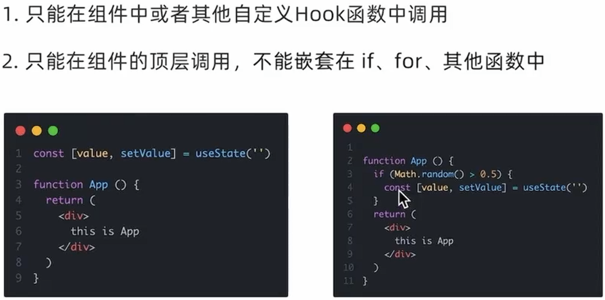
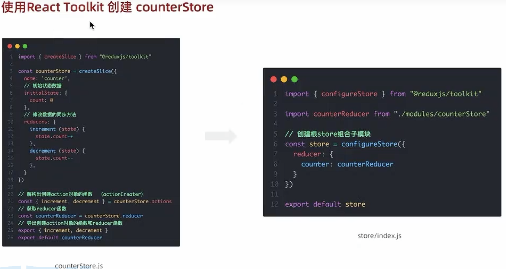
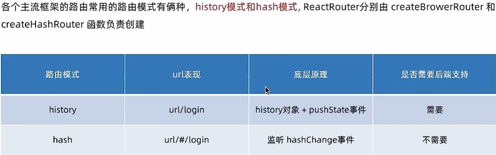

# react基础
创建： npx create-react-app name

## JSX
- {variable}插入变量
- 渲染列表： 注意每个元素需要一个唯一的key
	```
	<ul>
		{ list.map(item => <li key={item.id}>{item.content}</li> }
	```
- 事件绑定: 使用箭头函数避免函数立即调用  
	`const handleClick = (name) => { clg('..', name) }`
	`return <button onClick={() => handleClick('rog')}>click me</button>`  
- 类名控制（toggle）
	```
	className={ `classA ${type===item.type && 'active'}` }
	```

## 组件
```
// 名字首字母大写
const Button = () => {
  return <button>click me!</button>
}
function App () {
  return (
      <div className="App"
		{/* 写法一：单标签 */}
		<Button />
		{/* 写法二：成对标签 */}
		<Button></Button>
      </div>
A

```

### 组件样式
- 行内样式（不推荐）`<div style={{ color:'red' }}></div>
	- 可以把样式对象拿出来放在外面，更易读
- 导入css样式
	- 导入：`import './index.css`
	- 通过className控制：`<span className='foo'>...</span>`
	
### 组件通信

#### 父子通信
	```
	function Son(props) {
		return <div> son's name is {props.name}</div>
	}								  ↑ 这里调用定义好的name属性
	function App() {			   /
		const nameVal = 'Jay'   /
		return (		     /
			<div>		  /
				<Son name={nameVal} />	// 在Son标签中定义属性
			</div>
		)
	}
	```
	> props可以传递任意数据（对象/函数/JSX等）；
	> props是只读对象，即子不能修改父
- props.children
	- 例如在`<Son> <span> child </span> </Son>`
	- 'child'会被props.children属性捕获
- 子传父
	- 子组件中调用父中的函数并传参（回调函数）
	```
	function Son({ onGetSonMsg }) {	// 大括号表示对象解构
		const sonMsg = 'sons msg'
		return (
			<div>
				this is Son
				<button onClick={()=>onGetSonMsg(sonMsg)}>send</button>
			</div>
		)
	}
	function App() {
		const [msg, setMsg] = useState('')
		const getMsg = (msg) => {
			setMsg(msg)
		}
		return (
			<div>
				son's message is {msg}
				<Son onGetSonMsg={getMsg} />
			</div>
		)
	}
	```
#### 兄弟通信
- 实现：状态提升，通过父组件进行
	```
	function A({onGetAName}) {
		const name = 'this is A name'
		return (
			<div>
				this is A component
				<button onClick={() => onGetAName(name)}>send</button>
			</div>
		)
	}
	function B({name}) {
		return (
			<div>this is B component, {name}</div>
		)
	}
	function App() {
		const [name, setName] = useState('')
		const getAName = (name) => {
			setName(name)
		}
		return (
			<div>
				this is App
				<A onGetAName={getAName} />
				<B name={name} />
			</div>
		)
	}
	```
#### 跨层通信
	```
	// 1.创建context对象 
	import { createContext } from "react"
	...
	const yourContext = createContext
	
	function A() {
		return (
			<div>
				this is A component
				<B />
			</div>
		)
	}
	function B({name}) {
		// 3. 通过useContext钩子获取数据
		const msg = useContext(yourContext)
		return (
			<div>this is B component, {msg}</div>
		)
	}
		
	function App() {
		const msg = 'xxx'
		const [name, setName] = useState('')
		const getAName = (name) => {
			setName(name)
		}
		return (
			<div>
				// 2. 顶层组件中通过Provider组件提供数据
				<yourContext.Provider value={msg}>
					this is App
					<A onGetAName={getAName} />
				</yourContext.Provider>
			</div>
		)
	}
	```
	
## use- 钩子函数
函数组件的主体只应该用来返回组件的HTML，所有其他操作（副效应）都必须通过钩子引入

### useState
向组件添加一个状态变量，控制组件渲染（数据驱动视图）  
	```
	import { useState } from 'react'
	// 修改对象属性
	const [obj, setObj] = useState({ name: 'rog'})
	const changeObj = () => {
		setObj({
			...obj,
			name: 'Jay'
		})
	return (
		<div>
			<button onClick={changeObj}>{form.name}</button>
	```
	- 注意！直接修改obj虽然可以改变值，但无法更新视图（不能直接设置form.name = newName）
- 表单绑定
	```
	const [value, setValue] = useState('')
	<input value={value}, onChange={(e)=>setValue(e.target.value)} />
	```
- 注意
	- 可以直接传递新状态，也可以传递一个根据先前状态来计算新状态的**函数**(必须是纯函数)  
		`setAge(18)` `setAge(a => a + 1)`
	- ？set后读取状态仍是旧值： https://zh-hans.react.dev/reference/react/useState#ive-updated-the-state-but-logging-gives-me-the-old-value
	- 文档ref: https://zh-hans.react.dev/reference/react/useState#setstate

### useRef --获取DOM
1. useRef生成ref对象并绑定：  
2. ref.current获取dom进行后续操作   
	```
	function App() {
		const inputRef = useRef(null) 
		const show = () => clg(inputRef.current)
		return (
			<div>
				<input type="text" ref={inputRef} />
				<button onClick={show}>get DOM</button>
			</div>
		)
	```
	
### useEffect
- 用途：数据获取、事件监听或订阅、手动更改DOM等异步操作
- 用法
	```
	import { useState, useEffect } from 'react';
	function MyComponent() {
		const [data, setData] = useState(null);

		useEffect(() => {
			// 执行副作用操作
			fetchData().then(response => {
				setData(response.data);
			});

			// 可选的清理函数
			return () => {
				// 清理操作
			};
		}, []); // 依赖数组

		return (
			// JSX
		);
	}
	```
- 依赖数组决定执行时机
	- 无依赖：初始渲染和组件更新时
	- 空数组：初始渲染
	- 特定依赖：初始渲染和依赖变化时
- 返回值（清理函数）：组件卸载时，执行该函数，清理副效应
- 注意项
	- 清理函数不仅在卸载时执行一次，每次副效应重新执行前也会执行一次，来清理上次渲染的副效应
	- useEffect 应该在组件的顶层调用，不应在循环、条件或嵌套函数中调用
	- 如果你不需要与外部系统同步，可能不需要使用 useEffect
	- 严格模式下，React会在第一次真正的设置前额外运行一次开发环境下的设置和清理，这是一种压力测试
	- 如果有多个副效应，应该调用多个useEffect()，而不应该合并写在一起
	
### 自定义hook
封装可复用的逻辑。声明一个use开头的函数。
	```
	function useToggle() {
		const [value, setValue] = useState(true)
		const toggle = () => setValue(!value)
		return {
			value,
			toggle
		}
		
	function App() {
		const {value, toggle} = useToggle()
		return (
			<div>
				{value && <div>this is div</div>}
				<button onClick={ toggle }>toggle</button>
			</div>
		)
	```


### reactHooks使用规则
> 


-----------------
# Redux

## 

### 使用步骤
1. 定义一个**reducer**函数
2. **createStore**方法传入reducer，生成一个**store**实例对象
3. 使用store实例的**subscribe**方法订阅数据变化
4. 使用store实例的**dispatch**方法提交**action**对象触发数据变化
5. 使用store实例的**getState**方法获取最新状态数据更新视图

- 三个核心概念
	- state： 对象，存放管理的数据状态
	- action： 对象，描述怎么更改数据
	- reducer： 函数，根据action的描述生成新的state
```
<div>...
... // html
<script src="https://unpkg.com/redux@latest/dist/redux.min.js"
<script>
	// 1. state 初始状态 action 对象type标记要做的修改
	function reducer(state={count:0}, action) {
		if (action.type === 'INCREMENT'){
			return {count: state.count + 1}
		if (action.type === 'DECREMENT'){
			return {count: state.count - 1}
	// 2.
	const store = Redux.createStore(reducer)
	// 3.
	store.subscribe(() => {
		// 5.
		document.getElementById('count').innerText = 
			store.getState().count
	})
	// 4.
	const inBtn = document.getElementById('increment')
	inBtn.addEventListener('click', () => {
		store.dispatch({
			type: 'INCREMENT'
		})
	}
	const dBtn = document.getElementById('decrement')
	dBtn.addEventListener('click', () => {
		store.dispatch({
			type: 'DECREMENT'
		})
	}
```

> ##### 接入React
> 1. CRA快速创建React项目： `npx create-react-app react-redux`
> 2. 安装配套工具： `npm i @reduxjs/toolkit react-redux`
> 3. 启动: npm run start
> 代码部分 


------------------------------
# ReactRouter
安装：`npm install react-router-dom@6`
```

```

### 两种路由模式
- history
- hash
> 只用把createBrowserRouter换成createHashRouter即可，其它不用动
> 
