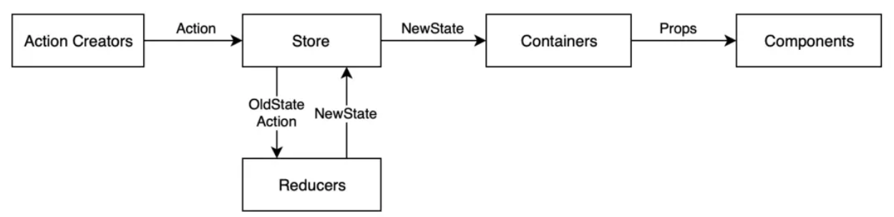

# react基础
创建： `npx create-react-app name`
> 下载启动太慢，更换镜像源：`npm config set registry https://registry.npm.taobao.org`
> 备用：https://registry.npmmirror.com/
> https://mirrors.huaweicloud.com/repository/npm/

## JSX
- {variable}插入变量
- 渲染列表： 注意每个元素需要一个唯一的key
	- 这是因为react通过这个key知道只用刷新哪个元素哪些部分而不用全部刷新
	```
	<ul>
		{ list.map(item => <li key={item.id}>{item.content}</li> }
	```
- 事件绑定: 使用箭头函数避免函数立即调用  
	`const handleClick = (name) => { clg('..', name) }`
	`return <button onClick={() => handleClick('rog')}>click me</button>`  
- 类名控制（toggle）
	```
	className={ `classA ${type===item.type && 'active'}` }
	```
- 其它
	- React17后不用再`import React from 'react'`了

## 组件
```
// 名字首字母大写
const Button = () => {
  return <button>click me!</button>
}
function App () {
  return (
      <div className="App"
		{/* 写法一：单标签 */}
		<Button />
		{/* 写法二：成对标签 */}
		<Button></Button>
      </div>
A

```
- 定义：`function Component() { return(..) }`
- 定义+导出 `export default function Component() { return(..) }`
> **语法		导出语句							导入语句**
>   默认		export default function B(){}	import Button from './Button.js';
> 	具名		export function Button() {}		import { Button } from './Button.js';
> 对于具名导入，导入和导出的名字必须一致。这也是称其为具名的原因；默认可以任取
> 通常，文件中仅含一个组件时，选择默认导出；而包含多个组件/某个值要导出时，选择具名导出

### 嵌套组件-将组件作为props传递
Card里包裹的所有内容都传入props.children
	```
	import Avatar from './Avatar.js';

	function Card({ children }) {
	  return (
		<div className="card">
		  {children}
		</div>
	  );
	}

	export default function Profile() {
	  return (
		<Card>
		  <Avatar
			size={100}
			person={{ 
			  name: 'Katsuko Saruhashi',
			  imageId: 'YfeOqp2'
			}}
		  />
		</Card>
	  );
	}
	```

### 组件样式
- 行内样式（不推荐）`<div style={{ color:'red' }}></div>
	- 可以把样式对象拿出来放在外面，更易读
- 导入css样式
	- 导入：`import './index.css`
	- 通过className控制：`<span className='foo'>...</span>`
	
### 组件通信

#### 父子通信
	```
	function Son(props) {
		return <div> son's name is {props.name}</div>
	}								  ↑ 这里调用定义好的name属性
	function App() {			   /
		const nameVal = 'Jay'   /
		return (		     /
			<div>		  /
				<Son name={nameVal} />	// 在Son标签中定义属性
			</div>
		)
	}
	```
	> props可以传递任意数据（对象/函数/JSX等）；
	> props是只读对象，即子不能修改父
- props.children
	- 例如在`<Son> <span> child </span> </Son>`
	- 'child'会被props.children属性捕获
- 子传父
	- 子组件中调用父中的函数并传参（回调函数）
	```
	function Son({ onGetSonMsg }) {	// 大括号表示对象解构!!
		const sonMsg = 'sons msg'
		return (
			<div>
				this is Son
				<button onClick={()=>onGetSonMsg(sonMsg)}>send</button>
			</div>
		)
	}
	function App() {
		const [msg, setMsg] = useState('')
		const getMsg = (msg) => {
			setMsg(msg)
		}
		return (
			<div>
				son's message is {msg}
				<Son onGetSonMsg={getMsg} />
			</div>
		)
	}
	```
- prop默认值: `function A({ person, size = 100 }) {}`
- 公共props：多个组件共同需要的属性参数，抽取出来避免冗余重复
	```
	const props = {
		inc: 2,
		underline: true,
		color: 'red'
	}
	<>
		<Button {...props} color='black' />
		<Button {...props} color='blue' />
		<Button color='green' />
	```

#### 兄弟通信
- 实现：状态提升，通过父组件进行
	```
	function A({onGetAName}) {
		const name = 'this is A name'
		return (
			<div>
				this is A component
				<button onClick={() => onGetAName(name)}>send</button>
			</div>
		)
	}
	function B({name}) {
		return (
			<div>this is B component, {name}</div>
		)
	}
	function App() {
		const [name, setName] = useState('')
		const getAName = (name) => {
			setName(name)
		}
		return (
			<div>
				this is App
				<A onGetAName={getAName} />
				<B name={name} />
			</div>
		)
	}
	```
#### 跨层通信
	```
	// 1.创建context对象 
	import { createContext } from "react"
	...
	const yourContext = createContext
	
	function A() {
		return (
			<div>
				this is A component
				<B />
			</div>
		)
	}
	function B({name}) {
		// 3. 通过useContext钩子获取数据
		const msg = useContext(yourContext)
		return (
			<div>this is B component, {msg}</div>
		)
	}
		
	function App() {
		const msg = 'xxx'
		const [name, setName] = useState('')
		const getAName = (name) => {
			setName(name)
		}
		return (
			<div>
				// 2. 顶层组件中通过Provider组件提供数据
				<yourContext.Provider value={msg}>
					this is App
					<A onGetAName={getAName} />
				</yourContext.Provider>
			</div>
		)
	}
	```
	
## use- 钩子函数
函数组件的主体只应该用来返回组件的HTML，所有其他操作（副效应）都必须通过钩子引入

### useState
向组件添加一个状态变量，控制组件渲染（数据驱动视图）  
	```
	import { useState } from 'react'
	// 修改对象属性
	const [obj, setObj] = useState({ name: 'rog'})
	const changeObj = () => {
		setObj({
			...obj,
			name: 'Jay'
		})
	return (
		<div>
			<button onClick={changeObj}>{form.name}</button>
	```
	- 注意！直接修改obj虽然可以改变值，但无法更新视图（不能直接设置form.name = newName）
- 表单绑定
	```
	const [value, setValue] = useState('')
	<input value={value}, onChange={(e)=>setValue(e.target.value)} />
	```
- 注意
	- ★可以直接传递新状态，也可以传递一个根据先前状态来计算新状态的**函数**(必须是纯函数)  
		- 不要直接操作状态变量，它是不可变的：× `setAge(a+1)`
		- set后读取a会发现值并未改变，应用：√ `setAge(a => a + 1)`（参数变量名称是任意的）
	- ？set后读取状态仍是旧值： https://zh-hans.react.dev/reference/react/useState#ive-updated-the-state-but-logging-gives-me-the-old-value
	- 文档ref: https://zh-hans.react.dev/reference/react/useState#setstate
	
### useReducer
1. 用传递给dispatch的action对象，表明用户刚刚做了什么
	```
	function handleDeleteTask(taskId) {
		dispatch(
			// "action" 对象：是一个普通的JS对象，应该至少包含可以表明发生了什么事情的信息
			{
				type: 'deleted',
				id: taskId,
			}
		);
	}
	```
2. 编写reducer函数，存放状态逻辑
	- 声明当前状态（tasks）作为第一个参数；
	- 声明 action 对象作为第二个参数；
	- 从 reducer 返回 下一个 状态（React 会将旧的状态设置为这个最新的状态）
	```
	// 建议将每个 case 块包装到花括号中，这样在不同 case 中声明的变量就不会互相冲突
	// 记得case应该以return结尾！
	function tasksReducer(tasks, action) {
		switch (action.type) {
			case 'added': {
				return [
					...tasks,
					{
						id: action.id,
						text: action.text,
						done: false,
					},
				];
			}
			case 'changed': {
				return tasks.map((t) => {
					if (t.id === action.task.id) {
						return action.task;
					} else {
						return t;
					}
				});
			}
			case 'deleted': {
				return tasks.filter((t) => t.id !== action.id);
			}
			default: {
				throw Error('未知 action: ' + action.type);
			}
		}
	}
	```
3. 将 tasksReducer 导入到组件中
	```
	const [tasks, dispatch] = useReducer(tasksReducer, initialTasks);
	
	```

- 事件处理程序只通过派发action来指定发生了什么，而reducer函数通过响应actions来决定状态如何更新
- 注意事项
	- 不要在reducer函数里放多余的东西，可能导致useReducer调用不了
	

### useContext
（见组件-跨层通信）

### useEffect
- 用途：数据获取、事件监听或订阅、手动更改DOM等异步操作
- 用法
	```
	import { useState, useEffect } from 'react';
	function MyComponent() {
		const [data, setData] = useState(null);

		useEffect(() => {
			// 执行副作用操作
			fetchData().then(response => {
				setData(response.data);
			});

			// 可选的清理函数
			return () => {
				// 清理操作
			};
		}, []); // 依赖数组

		return (
			// JSX
		);
	}
	```
- 依赖数组决定执行时机
	- 无依赖：初始渲染和组件更新时
	- 空数组：初始渲染
	- 特定依赖：初始渲染和依赖变化时
- 返回值（清理函数）：组件卸载时，执行该函数，清理副效应
- 注意项
	- 清理函数不仅在卸载时执行一次，每次副效应重新执行**前**也会执行一次，来清理上次渲染的副效应
	- useEffect 应该在组件的顶层调用，不应在循环、条件或嵌套函数中调用
	- 如果你不需要与外部系统同步，可能不需要使用 useEffect
	- 严格模式下，React会在第一次真正的设置前额外运行一次开发环境下的设置和清理，这是一种压力测试
	- 如果有多个副效应，应该调用多个useEffect()，而不应该合并写在一起

### useRef --获取DOM
1. useRef生成ref对象并绑定：  
2. ref.current获取dom进行后续操作   
作用：通常用来获取DOM元素，操作focus/animation/transition等以及管理Timers（如秒表计时刷新快）
	```
	function App() {
		const inputRef = useRef(null) 
		const show = () => clg(inputRef.current)
		return (
			<div>
				<input type="text" ref={inputRef} />
				<button onClick={show}>get DOM</button>
				<button onClick=() => {inputRef.current.focus()}>focus on input</button>
			</div>
		)
	```
	> ** 为什么有时要用useRef而不用useState？**
	> 因为setState会触发重新渲染，而使用ref不会重新渲染，对于高频刷新的元素能提高性能
	
### 自定义hook
封装可复用的逻辑。声明一个use开头的函数。
	```
	function useToggle() {
		const [value, setValue] = useState(true)
		const toggle = () => setValue(!value)
		return {
			value,
			toggle
		}
		
	function App() {
		const {value, toggle} = useToggle()
		return (
			<div>
				{value && <div>this is div</div>}
				<button onClick={ toggle }>toggle</button>
			</div>
		)
	```

### reactHooks使用规则
> 

? 自定义hook函数和普通函数有什么区别


## 杂项
**！注意事项**  
- “严格模式”下开发时，React会调用每个组件的函数两次，这可以帮助发现由不纯函数引起的错误
- setState会导致组件从头刷新，下列代码会导致死循环使页面无法渲染出来
	```
	export default function App() {
		const [item, setItem] = usestate("")
		setItem("new")
		return (...)
	```

### react中阻止事件冒泡
```
function Button({ onClick, children }) {
  return (
    <button onClick={e => {		// ①
      e.stopPropagation();
      onClick(); 
    }}>
      {children}
    </button>
  );
}
// ①你也可以在调用父元素 onClick 函数之前，向这个处理函数添加更多代码。
// 此模式是事件传播的替代方案 。它让子组件处理事件，也让父组件指定一些额外的行为。
export default function Toolbar() {
  return (
    <div className="Toolbar" onClick={() => {
      alert('你点击了 toolbar ！');
    }}>
      <Button onClick={() => alert('正在播放！')}>
        播放电影
      </Button>
      <Button onClick={() => alert('正在上传！')}>
        上传图片
      </Button>
    </div>
  );
}

```

-----------------
# Redux


### 使用步骤
1. 定义一个**reducer**函数
2. **createStore**方法传入reducer，生成一个**store**实例对象
3. 使用store实例的**subscribe**方法订阅数据变化
4. 使用store实例的**dispatch**方法提交**action**对象触发数据变化
5. 使用store实例的**getState**方法获取最新状态数据更新视图
(! createStore已被configureStore取代; 应使用ReduxToolkit的createSlice方法编写reducer逻辑)

- 三个核心概念
	- state： 对象，存放管理的数据状态
	- action： 对象，描述怎么更改数据
	- reducer： 函数，根据action的描述生成新的state
```
<div>...
... // html
<script src="https://unpkg.com/redux@latest/dist/redux.min.js"
<script>
	// 1. state 初始状态 action 对象type标记要做的修改
	function reducer(state={count:0}, action) {
		if (action.type === 'INCREMENT'){
			return {count: state.count + 1}
		if (action.type === 'DECREMENT'){
			return {count: state.count - 1}
	// 2.
	const store = Redux.createStore(reducer)
	// 3.
	store.subscribe(() => {
		// 5.
		document.getElementById('count').innerText = 
			store.getState().count
	})
	// 4.
	const inBtn = document.getElementById('increment')
	inBtn.addEventListener('click', () => {
		store.dispatch({
			type: 'INCREMENT'
		})
	}
	const dBtn = document.getElementById('decrement')
	dBtn.addEventListener('click', () => {
		store.dispatch({
			type: 'DECREMENT'
		})
	}
```
> ##### 接入React
> 1. CRA快速创建React项目： `npx create-react-app react-redux`
> 2. 安装配套工具： `npm i @reduxjs/toolkit react-redux`
> 3. 启动: npm run start
> 代码部分 
```
// ############  @src/store/modules/counterStore.js 子模块的创建  ############
import {createSlice} from '@reduxjs/toolkit'

const counterStore = createSlice([
	name: 'counter'
	initialState: {
		count: 0
	}
	// 修改数据的同步方法，支持直接修改
	reducers: {
		increment(state) {
			state.count++
		},
		decrement(state) {
			state.count--
		}
	}
])

// 解构actionCreater函数
const {increment, decrement} = counterStore.actions
const reducer = counterStore.reducer

// 导出
export { increment, decrement }
export default reducer

// ############  @src/store/index.js 子模块的组合  #####################
import {configureStore } from "@reduxjs/toolkit"
import counterReducer from './modules/counterStore'

const store = configureStore({
	reducer: {
		counter: counterReducer
	}
})

export default store

// ###########  @src/index.js 把store注入应用  ####################
// react-redux中间件提供Provider组件通过store参数把store实例注入应用
...
import store from './store'
import {Provider} from 'react-redux'
...
root.render(
	<Provider store={store}>	// 注入
		<App />
	</Provider>
)

// ###########  @App.js react组件中使用store数据： 钩子useSelector  ############
// ########### @App.js 修改数据：钩子useDispatch  ##############
import {useSelector, useDispatch} from 'react-redux'
import {increment,decrement} from './store/modules/counterStore.js'

function App() {
	const {count} = useSelector(state => state.counter) // counter对应configureStore中的
	const dispatch = useDispatch()
	return (
		<div>
			<button onClick={() => dispatch(decrement())}>-</button>
			{count}
			<button onClick={() => dispatch(increment())}>-</button>
		</div>
	)	

```

### 提交action传参
参数传递到action对象的payload属性：
`f(state, action) { state.count = action.payload }`

### 异步操作
单独封装一个函数，内部return一个新函数封装异步请求
```
// ############  @src/store/modules/asyncStore.js  #######
import {createSlice} from '@reduxjs/toolkit'

const asyncStore = createSlice({
	name: 'counter'
	initialState: {
		count: 0
	}
	// 修改数据的同步方法，支持直接修改
	reducers: {
		setValue (state, action) {
			state.count = action.payload
		}
	}
})
// 异步操作
const {setValue } = asyncStore.actions
const fetchData = () => {
	return async () => {
		const res = await axios.get(url)
		dispatch(setValue(res.data.data.xxx))
	}
	
// 导出
```

------------------------------
# ReactRouter
- 安装：`npm install react-router-dom@6`
- 内置组件
	- <BrowserRouter>
	- <HashRouter>
	- <Route>
	- <Redirect>
	- <Link>
	- <NavLink>
	- <Switch>
	> ##### ReactRouter6比5.x的改变
	> 移除了<Switch/>，新增<Routes/>
	> 语法变化：`componet={About}`→ `element={<About/>}`
	> 明确推荐函数式组件，新增多个hook
- 基本用法
	```
	function App() {
	  const [count, setCount]  = useState(0)
	  return (
		<BrowserRouter>
		  <Routes>
			<Route
              element={
				<>
                  <h1>Title</h1>
                  <Link to="/a/1">page_a_link</Link>
                  <br />
                  <Link to="/b">page_b_link</Link>
                  <Outlet />
                </>
              }
			>
              <Route path="/a/b?/id" element={<PageA/>}></Route>
              <Route path="/b" element={<div>b</div>}></Route>
            </Route>
          </Routes>
        </BrowserRouter>
	  )
	}
	```
- 配置
	- src/pages文件夹下新增Layout和Login文件夹，其中分别有index.js  
	`@ index.js`
	`const Layout = () => { return <div>Layout</div> }`
	`export default Layout`
	- router文件夹下新建index.js，配置路由
	``` @ index.js
	import Layout from ../pages/; import Login from ../pages/;
	import {createBrowserRouter} from 'react-router-dom'
	const router = createBrowserRouter([
		{
			path: '/',			// 注意逗号不要漏！
			element: <Layout />
		},
		{
			path: 'login',
			element: <Login />
		}
	])
	export default router
	```
	- 入口中（src下的index.js）渲染routerProvider  
	`import { RouterProvider } from 'react-router-dom'`
	`<RouterProvider router={router} />`
- Link标签
	- 功能：阻止点击链接对服务器的请求，与路由进行匹配注入页面内容
	- `<Link to="/">Home</Link>`
	> bug: ```<Link to={`official-home/contacts/1`}>Your Name</Link>```
	> 导致每点一次链接实际上是在原url上接续，导致404
	> 解决：路径前加上/
- router参数
	- 设置属性`path: /blog/:id`,id为参数
	- 
- 二级路由
	- 默认二级路由（访问一级路由，二级可以得到渲染）
		- 将默认二级路由的path去掉，新设置index: true
- 配置@别名路径
通过@替代src路径，方便开放过程中查找访问路径(当嵌套层次深时)
	- 安装craco `npm i @craco/craco -D`
	- 新建craco.config.js文件并写入：
		```
		const path = require('path')
		module.exports = {
			webpack: {
				alias: {
					'@': path.resolve(__dirname, 'src')
				}
			}
		}
		```
	- 修改package.json：  
		`"start": "craco start",`
		`"build": "craco build",`
		`"test": "craco test",`
		`"eject": "react-scripts eject"
- 中止fetch
	- 问题：Warning: Can't perform a React state update on index.js:1 an unmounted component
	- 原因：请求新页面时旧页面还咋请求中
	- 解决
		- useEffect开头添加：`const abortCon = new AbortController()`
		- fetch增加参数：`fetch(url, {signal: abortCon.signal})`
		- 清除副作用：`return () => abortCon.abort()`
	
### useHistory useNavigate

### 两种路由模式
- history
- hash
> 只用把createBrowserRouter换成createHashRouter即可，其它不用动
> 

--------------------
# 问题专区
- 正确使用了router但打开除初始页其它url时显示Cannot GET /xxx
	- 服务端没有处理该请求的逻辑（应该由ReactRouter完成）链接：https://juejin.cn/post/6844904086521774093
	- webpack.config添加`output: { ...publicPath: '/' //配置1},... devServer: { historyApiFallback: true //配置2 }`
- css文件 “You may need an appropriate loader to handle this file type, currently no loaders are configured to process this file
	- 安装css加载器：style-loader和css-loader
	- 并在webpack里注册  https://www.cnblogs.com/canjiaXQD/p/14994767.html
	```
	module: {
        rules: [{
            test: /\.css$/,
            use: ['style-loader', 'css-loader']
        }]
	}
	```
- 
--------------------
# 组件库
antd: npm install antd --save

```
// digital clock
function DigitalClock() {
	const [time, setTime] = useState(new Date())
	
	useEffect(() => {
		const intervalId = setInterval(() => {
			setTime(new Date())
		}, 1000)
		return () => {
			clearInterval(intervalId)
		}
	}, [])
	
	function formatTime() {
		let hours = time.getHours()
		const minutes = time.getMinutes()
		const seconds = time.getSeconds()
		const meridiem = hours >= 12 ? "PM" : "AM"
		hours = hours%12||12
		return `${hours}:${minutes}:${seconds} ${meridiem}`
	}
	// 需要加上前导0，自行设计
	
	return (
		<div className="clock-container">
			<div className="clock">
				<span>00:00:00</span>
			</div>
		</div>
	)
}
export default DigitalClock


```
