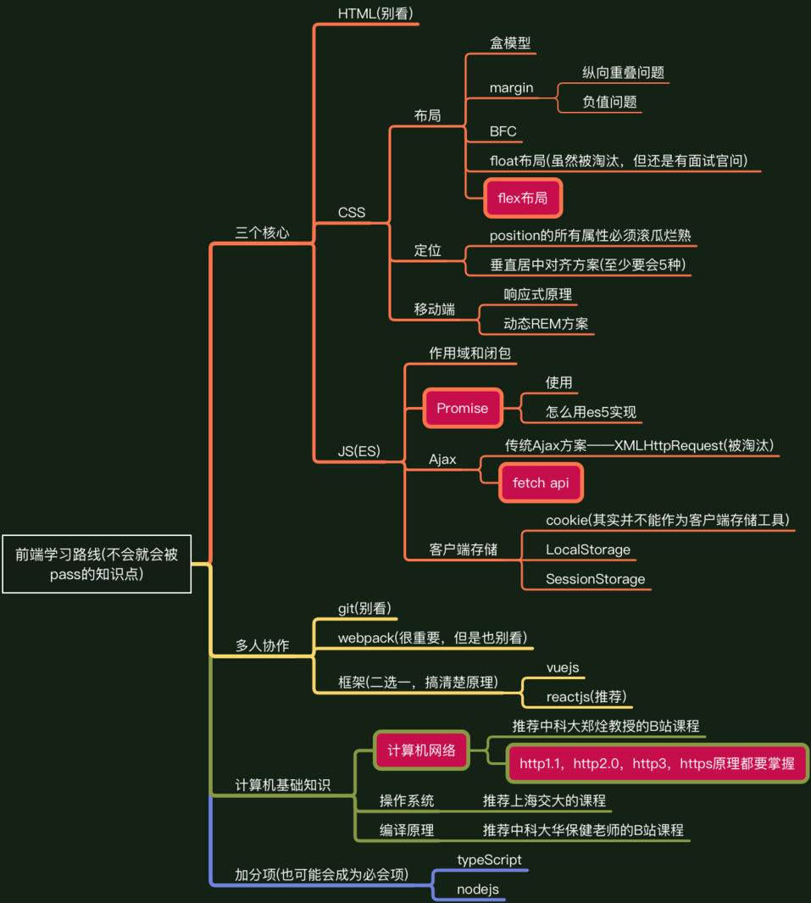
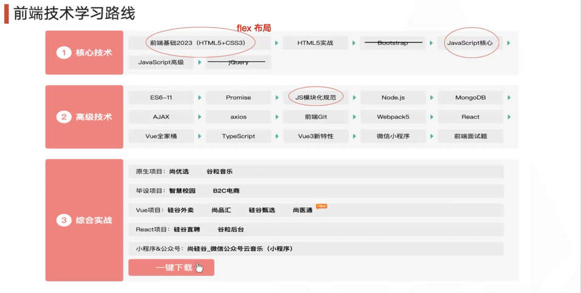

# 前端学习资料
> 小铭系列分享会
- 21前端技术分享会
	- 前后端薪资相当 眼界 高级前端 前端学习成本成倍增加 
	  兴趣是最重要的 一年做三个项目出来 实习千万别去小公司 成长期3个月
	- 要不要选择前端：1.后端深前端浅？ 错误，深浅根据做的东西来定的 
	  2.后端好升职前端没前途？× 取决于公司增长，部门重不重视前端 
	  3.纯前端前景？ 别做纯前端，不要定死，不要受限（后端同理）
	- 学习路线（比较偏激）
		> webpack到公司接触环境了再仔细看；编译原理 怎么吧react/vue编译成JS
		> easy题关注最优解 200题差不多了 不要hard 做过的题必须会
		> 定个目标，学完一个东西要做一个小项目出来
		> 不要焦虑，我们都要35岁危机那互联网就倒闭了 
		> java去阿里，go去字节腾讯。 要去部门里好的组
		> 
		> 
	- 课程
		- 计算机网络 自顶向下方法课程：https://www.bilibili.com/video/BV1JV411t7ow/?vd_source=b8ff9c0b4bd2d5ac9f6cda473102793e
		- 现代操作系统-原理和实现
		- 编译原理 华保键：https://www.bilibili.com/video/BV1m7411d7iS/?vd_source=b8ff9c0b4bd2d5ac9f6cda473102793e
- 23前端圆桌
	- 语言网络等基础一定要熟，进阶可以看一下使用过的框架的原理
	- 看书和博客的话尽量看较新的版本
	- 八股背的差不多就可以去面了，多面试，在面试中就能知道重点在哪里，也能够对知识查漏补缺
	- 主动告诉面试官自己了解的地方，面试是互相了解的过程，面试官在面试过程中对你描述的点会深挖面试官想知道的东
	- 向上管理，不是做的多做的好就行，不仅要做得好还要能说出来。leader的转正承诺不一定能给到，不要ALL IN。
- 23fury
	- 学习路线
		- 核心技术：H5 + CSS3 + JS核心【h5的标签、css的布局**flex**、JS继承 闭包 ES6】
		- 高级技术：**Promise** JS模块化规范 node.js Ajax axios；webpack5加分项，一两天过一下TS
		- 框架：学完做一个微信小程序或PC端的项目
		> 面试官可能会问你的项目有什么难点。单纯就找实习来讲，能够把某个功能完整的讲清楚，让面试官相信这是你自己做的，就足够了。
		> 面试官可能会对你的项目提一些新需求，让你现场说出实现思路，对于这个问题还是要多动手敲一敲，理解项目的结构。
		> 项目选择：github高星项目、硅谷直聘、工程实践。最好能获得项目的源代码	
		> 补充：项目牛不牛没关系，只要你能把你的项目讲清楚就好了。不要怕项目烂大街，只要你对项目非常理解，为什么这么做，这么做有什么好处，后面可能会遇到什么问题，应该怎么解决。能够把项目解释清楚，就足够了。
		> 
	- 力扣200-300题足够 Hot100和CodeTop高频（重点字节的） 最好用JS写算法
	- 12月之后开始针对性的刷，刷太早可能会忘。每天大概3-5题，刷过一轮可以再刷一刷
	- 前端特色内容 & 大厂必问：面试官指定JS里面一些特有的方法，让你自己实现它，比如防抖、节流、Promise的方法。嘉宾也总结了一些，资源地址github.com/ustcFury/handwriting-algorithm
	
# 前端论坛
- Tauri和electron
	- Tauri打包体积和内存占用小
	- 但用户是否在意
	- 且跨平台webview适配问题
